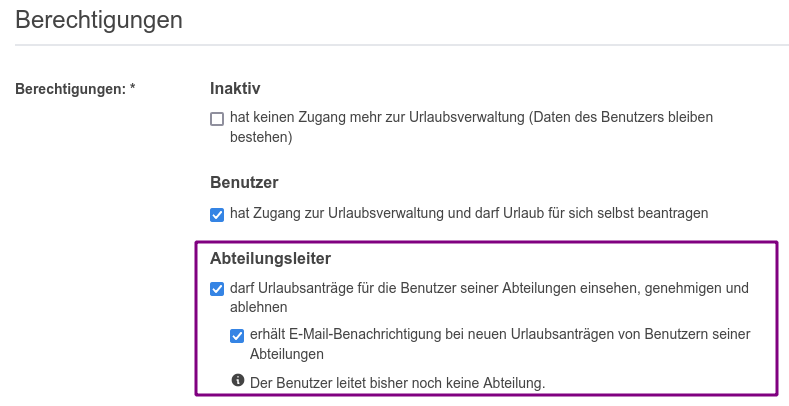
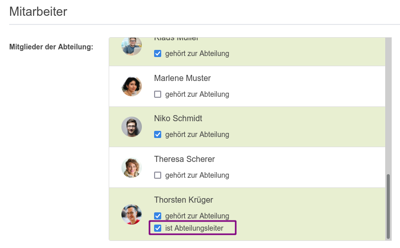

# Die Bedeutung von Abteilungen in focus:shift

Abteilungen sind eine Gruppierung von Mitarbeitenden,
die in der Regel ein berechtigtes Interesse daran haben die Abwesenheiten anderer Abteilungsmitglieder zu sehen,
um Urlaubsanträge untereinander abzustimmen.
Zusätzlich kommt mit einer Abteilung die Möglichkeit einher, einen Abteilungsleiter benennen zu können,
der Abwesenheiten für die Mitglieder seiner Abteilungen einsehen, genehmigen und ablehnen darf.

## Wie kann eine Abteilung angelegt werden?

In der Navigation gibt es unter "Unternehmen" den Punkt "Abteilungen". Hier können Personen mit
der Berechtigung _Office_ oder _Chef_ die bestehenden Abteilungen sehen.
Personen mit der Berechtigung _Office_ können über "Neue Abteilung" weitere Abteilungen anlegen
sowie bestehende Abteilungen bearbeiten und löschen.

## Wie werden Abteilungen Mitarbeiter zugeordnet?

Sowohl beim Anlegen einer neuen Abteilung als auch beim Bearbeiten einer
bestehenden Abteilung können die Mitarbeiter zu der Abteilung zugeordnet werden.

## Wie werden den Abteilungen Abteilungsleiter zugeordnet?

Damit ein Mitarbeiter überhaupt Abteilungsleiter werden kann, muss er die
entsprechende Berechtigung _Abteilungsleiter_ erhalten. Die Konfiguration von Berechtigungen wird [hier](../benutzer/#wie-stelle-ich-die-berechtigungen-eines-benutzers-ein) beschrieben.

    

Nun geht man über "Unternehmen > Abteilungen" zu den Abteilungen. Hier kann man eine bestehende Abteilung bearbeiten oder eine neue anlegen. Beim Zuordnen der Mitarbeiter zu einer Abteilung hat man bei Benutzern mit der entsprechenden Berechtigung die zusätzliche Auswahlmöglichkeit "ist Abteilungsleiter". Die Person muss außerdem mit "gehört zur Abteilung" Mitglied der Abteilung sein. Wählt man beide Optionen aus und speichert die Zuordnung, wird der entsprechende Benutzer zum Abteilungsleiter dieser Abteilung.

    

## Wie funktioniert der zweistufige Genehmigungsprozess?

Für jede Abteilung kann beim Anlegen oder Bearbeiten die Option "Zweistufigen Genehmigungsprozess aktivieren" gewählt werden.
Anträge der Mitglieder werden dann zuerst vorläufig durch den Abteilungsleiter und anschließend endgültig durch den Freigabe-Verantwortlichen genehmigt.
Der Freigabe-Verantwortliche kann Anträge auch ohne vorläufige Genehmigung genehmigen.
Anträge der Abteilungsleiter werden durch die Freigabe-Verantwortlichen genehmigt.

Dafür muss mindestens eine Person mit der Berechtigung _Freigabe-Verantwortlicher_ zur Abteilung gehören
und bei ihr die Option "ist verantwortlich für die Freigabe vorläufig genehmigter Anträge" ausgewählt sein.
