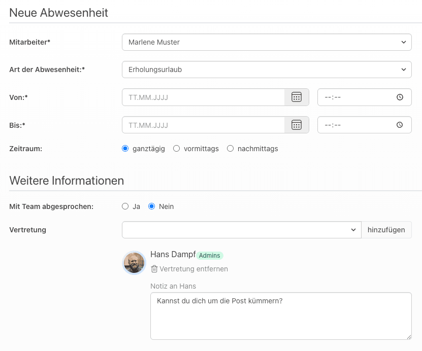
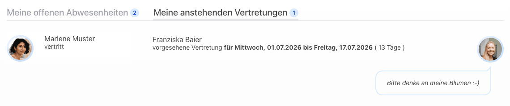
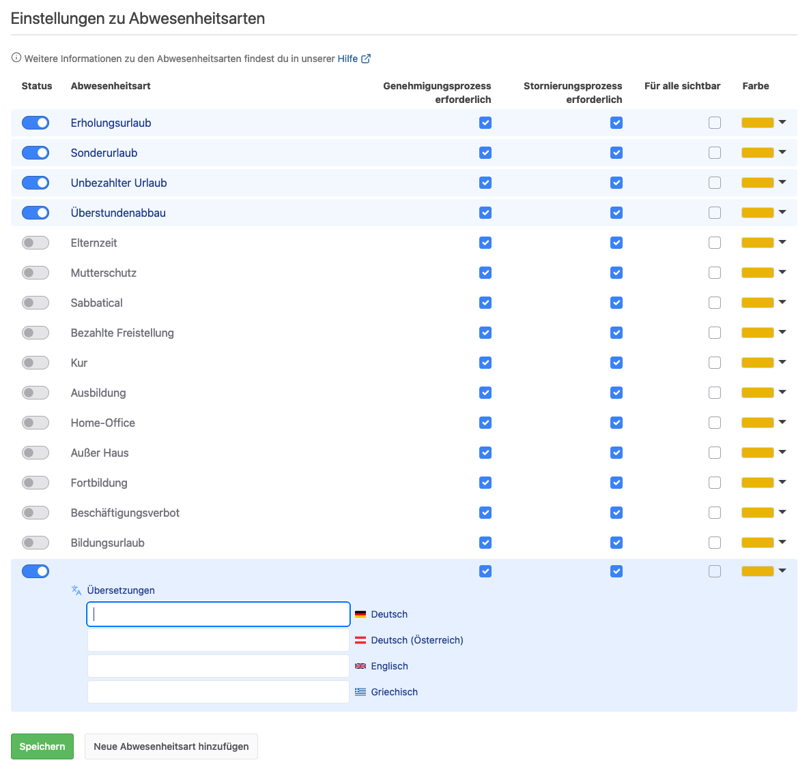
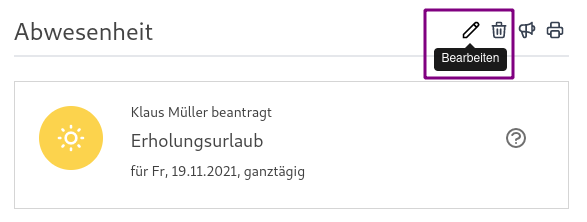
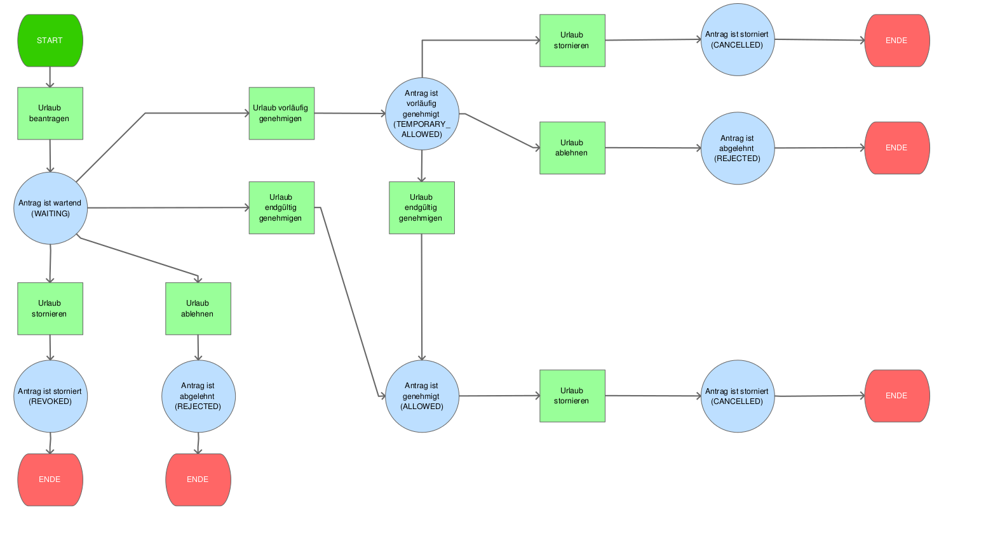

# Abwesenheiten (Urlaub, Krankmeldung & Überstundenabbau) richtig pflegen

Im Gegensatz zur Pflege der Anwesenheiten in der Zeiterfassung können in der Urlaubsverwaltung
unterschiedliche Arten von Abwesenheiten wie z. B. Urlaube, Krankmeldungen oder Überstundenabbau gepflegt werden.
Letzteres kann in den Einstellungen aktiviert oder deaktiviert werden.

## Wer genehmigt eine Abwesenheit?

Der einfache Genehmigungsprozess für Abwesenheiten sieht vor, dass
Abwesenheitsanträge von einem Abteilungsleiter oder Chef genehmigt werden.

Außerdem gibt es in der Urlaubsverwaltung auch
einen [zweistufigen Genehmigungsprozess](#wie-funktioniert-der-zweistufige-genehmigungsprozess-von-abwesenheiten).

## Wer wird informiert, wenn ein Abwesenheitsantrag gestellt wurde?

Wenn ein Abwesenheitsantrag gestellt wurde, erhält der betroffene Mitarbeitende sowie alle Personen, die ein berechtigtes Interesse
an dieser Information haben, wie der Abteilungsleiter und Freigabe-Verantwortlicher des Mitarbeitenden als auch Chefs
und Office-Mitarbeitende eine E-Mail-Benachrichtigung.

Vorausgesetzt bei diesen Personen ist die entsprechende E-Mail-Benachrichtigung aktiviert.
Chefs und Office-Mitarbeitende können die Benachrichtigung auf ihre eigenen Abteilungen beschränken.

## Wer wird informiert, wenn ein Abwesenheitsantrag genehmigt wurde?

Wenn ein Abwesenheitsantrag genehmigt wurde, erhalten sowohl der betroffene Mitarbeitende als auch alle Personen, die ein
berechtigtes Interesse an dieser Information haben, wie der Abteilungsleiter und Freigabe-Verantwortlicher des Mitarbeitenden,
Chefs und Office-Mitarbeitende eine E-Mail-Benachrichtigung. Auch Kolleg:innen können über genehmigte Abwesenheiten informiert werden.

Vorausgesetzt bei diesen Personen ist die entsprechende E-Mail-Benachrichtigung aktiviert.

## Wer wird informiert, wenn ein Abwesenheitsantrag abgelehnt wurde?

Wenn ein Abwesenheitsantrag abgelehnt wurde, erhält der betroffene Mitarbeitende eine E-Mail.
Außerdem werden der Abteilungsleiter und Freigabe-Verantwortlicher des Mitarbeitenden, Chefs und Office-Mitarbeitende
informiert, sofern bei ihnen die entsprechende E-Mail-Benachrichtigung aktiviert ist.

## Kann eine Vertretung angegeben werden?

Ja, bei der Antragsstellung können optional eine oder mehrere Vertretungen angegeben werden. Für jede Vertretung kann
eine eigene Notiz hinterlegt werden. Die ausgewählten Personen werden über die Vertretung per E-Mail benachrichtigt.

Außerdem ist für die Vertretung unter dem Menüpunkt "Meine Aufgaben" im Tab "Meine anstehenden Vertretungen"
eine Übersicht aller Vertretungen einsehbar.

## Wird die Vertretung informiert?

Die Vertretung erhält eine Mitteilung per E-Mail, sobald sie als Vertretung eingetragen wurde.
Wird die Abwesenheit genehmigt oder storniert, erhält die Vertretung eine weitere E-Mail. Diese enthält zusätzlich
einen Kalendereintrag als Anhang für den Import in den eigenen Kalender.

## Wie funktioniert der zweistufige Genehmigungsprozess von Abwesenheiten?

Der einfache Genehmigungsprozess für Abwesenheitsanträge sieht vor, dass
die Anträge von einem Abteilungsleiter oder Chef genehmigt werden.

Beim zweistufigen Genehmigungsprozess ist der Antrag nach der
Genehmigung durch den zuständigen Abteilungsleiter nur vorläufig genehmigt.
Die endgültige Freigabe erfolgt durch einen Benutzer mit der Berechtigung
Freigabe-Verantwortlicher. Der Freigabe-Verantwortliche kann Anträge auch
ohne vorläufige Genehmigung direkt genehmigen.

Voraussetzungen: Wie beim Abteilungsleiter muss der Freigabe-Verantwortliche der
Abteilung zugeordnet sein, für deren Mitarbeiter er zuständig ist. Des Weiteren
muss der zweistufige Genehmigungsprozess für die einzelnen Abteilungen aktiviert
werden. So lassen sich beide Workflows für jeweils verschiedene Abteilungen
nutzen.

## Welche Abwesenheitsarten gibt es?

Die Urlaubsverwaltung ist mit folgenden Abwesenheitsarten standardmäßig voreingestellt:

- Erholungsurlaub
- Sonderurlaub
- Unbezahlter Urlaub
- Überstundenabbau

Zusätzlich können viele weitere Abwesenheitsarten unter "Einstellungen > Abwesenheitsarten" aktiviert werden. Ebenso können individuelle Abwesenheitsarten angelegt werden.

Die Aktivierung und Deaktivierung ist jederzeit möglich. Bitte beachte, dass durch eine Änderung der Einstellungen bereits vorhandene Abwesenheiten mit der betreffenden Abwesenheitsart nicht verändert werden.

## Wie können zusätzliche Abwesenheitsarten konfiguriert werden?

Weitere Abwesenheitsarten können unter "Einstellungen > Abwesenheitsarten" festgelegt werden. Neben einem vordefinierten Set von Abwesenheitsarten können auch individuelle Abwesenheitsarten hinzugefügt werden. Dank der entsprechenden Übersetzungen ins Deutsche, Österreichische, Englische und Griechische bist du auch für deine internationalen Kollegen bestens gerüstet. Die individuellen Abwesenheitsarten werden zudem in der Zeiterfassung berücksichtigt, sodass die Sollstunden entsprechend reduziert werden.

## Ist es möglich für eine Abwesenheitsart den Genehmigungsprozess zu aktivieren / deaktivieren?

Ja, du kannst pro Abwesenheitsart mit "Genehmigungsprozess erforderlich" festlegen, ob eine Genehmigung notwendig ist, z. B. könnte man die Abwesenheitsart
"Ausbildung" ohne Genehmigungsprozess konfigurieren, wohingegen eine "Fortbildung" genehmigt werden muss.

Bitte beachte zusätzlich, dass der für die Abteilung aktive Genehmigungsprozess verwendet wird.

## Kann eine genehmigte Abwesenheit storniert werden?

Ja. Pro Abwesenheitsart legst du mit "Stornierungsprozess erforderlich" fest, wie eine genehmigte Abwesenheit storniert wird:

- Ist der Stornierungsprozess nicht erforderlich, kann der Mitarbeitende seine Abwesenheit selbst direkt stornieren.
- Ist der Stornierungsprozess erforderlich, beantragt der Mitarbeitende die Stornierung. Die Abwesenheit hat dann den Status "Stornierung beantragt", bis eine berechtigte Person (z. B. mit der Berechtigung Office) die Stornierung durchführt oder ablehnt.

## Ist es möglich eine bestimmte Abwesenheitsart für alle Mitarbeitenden sichtbar zu machen?

Ja, du kannst pro Abwesenheitsart festlegen, ob diese für alle Mitarbeitenden sichtbar ist und ohne Informationsverlust
dargestellt wird.  
Was bedeutet das?
Wenn bei einer Abwesenheitsart die Checkbox "Für alle sichtbar" deaktiviert ist, werden die Informationen dieser Anträge
lediglich für die Mitarbeitenden dargestellt, welche ein berechtigtes Interesse an der Information haben, dass es sich
z. B. um einen Erholungsurlaub handelt.
Ist die Checkbox aktiviert, erhalten alle Mitarbeitenden, welche die Anträge der Person sehen können, die Information
über die Abwesenheitsart. Hiermit könnte man z. B. die Abwesenheitsart "Home-Office" für alle sichtbar machen, sodass diese Information in der Abwesenheitsübersicht zur Verfügung steht.

## Ist es möglich die Anzeigefarbe einer Abwesenheitsart anzupassen?

Ja, du kannst bei den Einstellungen zu Abwesenheitsarten die Farbe pro Abwesenheitsart konfigurieren.
Diese Farbe wird dann in allen Kalendern und in der Abwesenheitsübersicht verwendet.

## Wie kann ich einen Antrag bearbeiten?

Ein selbst erstellter Antrag kann bearbeitet werden, solange er noch nicht genehmigt wurde. Diese Bearbeitung kann vom Mitarbeiter selbst durchgeführt werden.

Bereits genehmigte Anträge können von Benutzern mit der Berechtigung Office bearbeitet werden. Abteilungsleiter und
Freigabe-Verantwortliche mit der zusätzlichen Berechtigung "Pflege von Abwesenheiten" können die Anträge der Personen
bearbeiten, für die sie zuständig sind. Abgelehnte, zurückgezogene oder stornierte Anträge können nicht mehr bearbeitet werden.

## Wie funktioniert der Übergang zwischen zwei Jahren?

Der Erholungsurlaub, welcher im bisherigen Jahr noch nicht genommen wurde, wird in das folgende Jahr als Resturlaub mit
Verfall zum Stichtag übernommen. Diese Übernahme passiert in den Standard-Einstellungen am 1.1. des Folgejahres um 05:00 Uhr.
Der übernommene Resturlaub beinhaltet alle bis zum 31.12. nicht genommenen Urlaubstage. Dieser Resturlaub kann dann bis
zum Ende des Monats März genommen werden. Somit verfällt der Resturlaub in den Standardeinstellungen zum 1. April.
Unter "Einstellungen > Konto" kann der Stichtag global geändert oder der Verfall mit "Globaler Verfall von Resturlaub"
ganz abgeschaltet werden. Zusätzlich kann der Verfall pro Benutzer individuell konfiguriert werden.

## Workflow bei Abwesenheitsanträgen

    

Nicht im Diagramm enthalten ist der Status "Stornierung beantragt": Ist für die Abwesenheitsart ein
[Stornierungsprozess erforderlich](#kann-eine-genehmigte-abwesenheit-storniert-werden), wird aus einem genehmigten Antrag
zunächst ein Antrag mit beantragter Stornierung. Dieser wird anschließend storniert oder die Stornierung wird abgelehnt.
