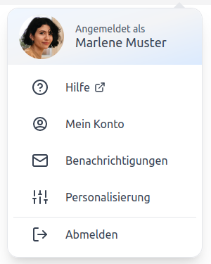
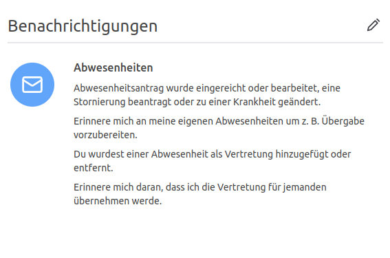
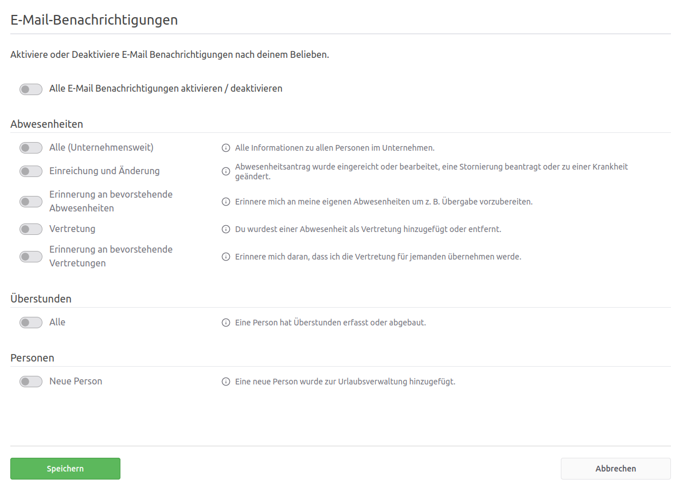

# E-Mail Benachrichtigungen in focus:shift

Um auf dem Laufenden zu bleiben und die Prozesse zu beschleunigen, werden Benachrichtigungen
und Erinnerungen per E-Mail versendet. Das sind zum einen Ereignisse, die eine Aktion benötigen, z. B. ein Antrag,
der genehmigt werden muss, und zum anderen Informationen, z. B. über die Abwesenheiten, Krankmeldungen oder
Überstunden von Kolleg:innen.

## Wie kann ich den E-Mail-Versand für mich oder einer anderen Person aktivieren oder deaktivieren?

Als Benutzer kann ich jederzeit meine eigenen Benachrichtigungen bzw. mit der Berechtigung _Office_ die einer anderen
Person anpassen. Diese Einstellung ist für sich selbst über das Avatar-Menü bzw. für anderen Personen über das Konto
der Person möglich.

        
        

Benachrichtigungen können pro Person aktiviert bzw. deaktiviert werden. Hier bleibt es ganz der Person
überlassen, welche Nachrichten diese per E-Mail erhalten möchte. Mit "Alle E-Mail Benachrichtigungen aktivieren /
deaktivieren" lassen sich alle Benachrichtigungen auf einmal umschalten.

Die Benachrichtigungen sind auf zwei Tabs aufgeteilt:

- **Persönlich:** Benachrichtigungen zu den eigenen Abwesenheiten, Krankmeldungen und Überstunden, z. B. Einreichungen
  und Änderungen, Vertretungen oder Erinnerungen an bevorstehende Abwesenheiten.
- **Abteilungen:** Benachrichtigungen zu den Abwesenheiten, Krankmeldungen und Überstunden der Kolleg:innen, für die
  man zuständig ist, z. B. Einreichungen, Genehmigungen, Stornierungen oder die Erinnerung für wartende zu
  genehmigende Abwesenheiten. Bei den Krankmeldungen gehören dazu auch eingereichte Verlängerungen und stornierte
  Krankmeldungen. Personen mit der Berechtigung _Office_ bzw. _Chef_ können mit "nur meine Abteilungen" festlegen, ob
  sie diese Benachrichtigungen nur für ihre Abteilungen oder für das gesamte Unternehmen erhalten.

Bestimmte Benachrichtigungen können nur mit einer bestimmten Berechtigung aktiviert werden. Zum Beispiel wird die
Benachrichtigung "Neue Person", dass eine neue Person zur Urlaubsverwaltung hinzugefügt wurde, nur Personen mit der
Berechtigung _Office_ bzw. _Chef_ angezeigt. Personen mit der Berechtigung _Office_ können außerdem unter
"Urlaubsanspruch" die Benachrichtigung "Resturlaub von Personen" aktivieren. Damit erhalten sie zum Jahreswechsel den
mitgenommenen Resturlaub und nach dem Verfallsdatum den verfallenen Resturlaub aller Personen, jeweils mit einer
Aufstellung als CSV-Datei.

    

## Welche Benachrichtigungen gibt es in der Urlaubsverwaltung, die ich derzeit noch nicht deaktivieren kann?

Bei folgenden Ereignissen werden Benachrichtigungen an die betreffenden Personen versendet, die sich nicht
deaktivieren lassen:

- Erinnerung an einen offenen Antrag, die die antragstellende Person selbst an die zuständigen Personen verschickt
- Weiterleitung eines Antrags an eine andere zuständige Person
- Erinnerung an das Ende der Lohnfortzahlung
- Informationen zum vorhandenen Resturlaub bei Jahreswechsel an die Person selbst
- Erinnerung an noch nicht genommenen Urlaub im laufenden Jahr, Erinnerung an bald verfallenden Resturlaub und
  Information über verfallenen Resturlaub an die Person selbst
- Information über erweiterte Berechtigungen an die betroffene Person

Die automatische Erinnerung an wartende Anträge erhalten nur Personen mit der Berechtigung _Chef_, _Abteilungsleiter_
oder _Freigabe-Verantwortlicher_. Sie können die Erinnerung in ihren Benachrichtigungen im Tab "Abteilungen" unter
"Erinnerung für wartende zu genehmigende Abwesenheiten" deaktivieren. Personen, die nur die Berechtigung _Office_ haben,
sehen diese Benachrichtigung nicht. Sie können die automatische Erinnerung aber unter "Einstellungen > Abwesenheiten"
mit "Automatische Erinnerung für wartende zu genehmigende Abwesenheiten" für alle aktivieren oder deaktivieren.
