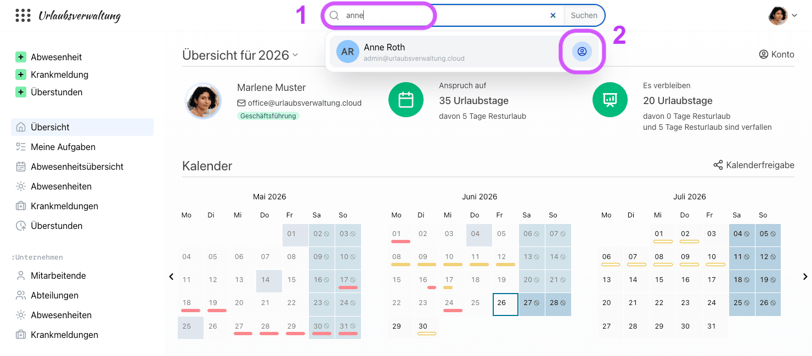
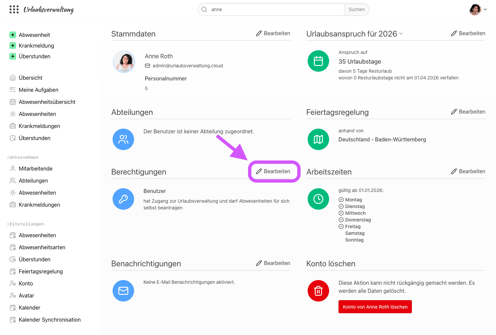
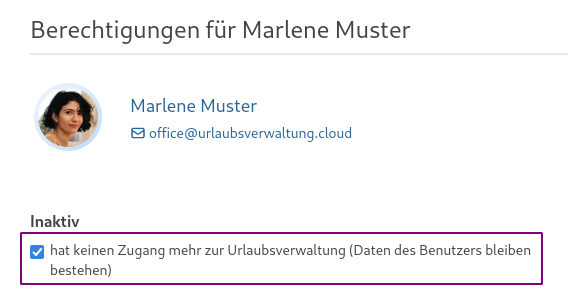
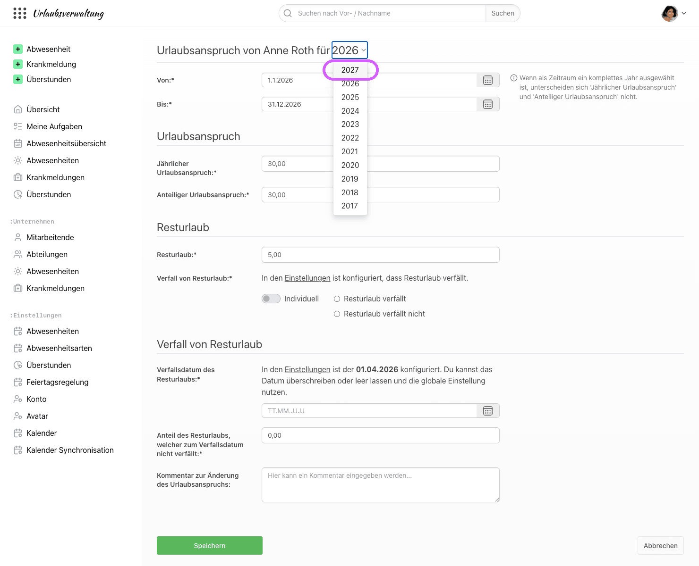
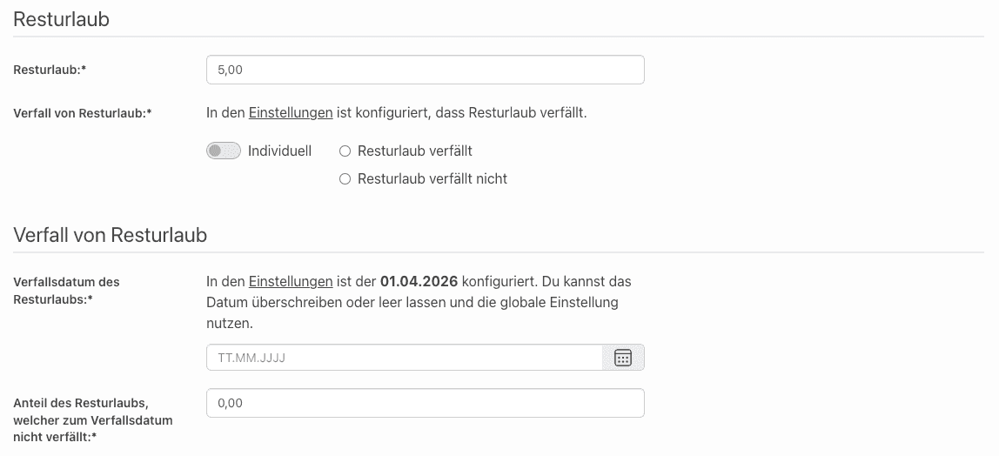

# Benutzer und ihre Berechtigungen in focus:shift

Ohne Mitarbeitende, kein Unternehmen. Die Verwaltung der Mitarbeitenden und ihre Berechtigungen
sind zentraler Teil der Urlaubsverwaltung.

## Welche Berechtigungen gibt es?

In der Urlaubsverwaltung gibt es aktuell folgende Arten von Berechtigungen:

- **Benutzer**: hat Zugang zur Urlaubsverwaltung und darf Abwesenheiten für sich selbst beantragen
- **Abteilungsleiter**: darf Abwesenheiten für die Benutzer seiner Abteilungen einsehen, genehmigen und ablehnen
- **Freigabe-Verantwortlicher**: ist bei der zweistufigen Genehmigung von Anträgen verantwortlich für die endgültige Freigabe
- **Chef**: darf Abwesenheiten **aller** Benutzer einsehen, genehmigen und ablehnen
- **Office**: darf Einstellungen zur Anwendung vornehmen, die Daten **aller** Mitarbeiter verwalten, Abwesenheiten für **alle** Mitarbeiter beantragen/stornieren und Krankmeldungen pflegen

Zusätzlich können Abteilungsleitern, Freigabe-Verantwortlichen und Chefs weitere Berechtigungen gegeben werden:

- **Pflege von Krankmeldungen**: darf Krankmeldungen aller Mitarbeitenden pflegen, für die die Person verantwortlich ist
- **Pflege von Abwesenheiten**: darf Abwesenheiten aller Mitarbeitenden pflegen, für die die Person verantwortlich ist

Beide Funktionen sind in der Berechtigung _Office_ bereits enthalten.

Über den Status _Inaktiv_ hat eine Person keinen Zugang mehr zur Urlaubsverwaltung, ihre Daten bleiben aber bestehen (siehe [Wie kann ich Benutzer löschen?](#wie-kann-ich-benutzer-loeschen)).

Es ist geplant, das aktuelle Berechtigungskonzept [feingranularer](https://github.com/urlaubsverwaltung/urlaubsverwaltung/issues/467) zu gestalten.

## Wie stelle ich die Berechtigungen eines Benutzers ein?

Als Benutzer mit der Berechtigung _Office_ kannst du über die Suche jemanden finden und direkt in das jeweilige Konto der betreffenden Person navigieren.
Die Suche findet nur aktive Personen. Inaktive Personen findest du unter "Unternehmen > Mitarbeitende" bei "Inaktive Mitarbeitende".

Hier gibt es die Möglichkeit die Berechtigungen über den Bearbeiten-Button zu editieren.

## Wann greifen neue Berechtigungen für einen Benutzer?

Nachdem die Berechtigungen für einen Mitarbeitenden angepasst wurden, sind diese sofort aktiv. Der Mitarbeitende muss sich _nicht_ erneut anmelden.

## Welcher Benutzer darf nach Registrierung Einstellungen vornehmen?

Nach der Registrierung der Urlaubsverwaltung bekommt der erste Benutzer automatisch die Berechtigung _Office_

> darf Einstellungen zur Anwendung vornehmen, die Daten aller Mitarbeiter verwalten, Abwesenheiten für alle Mitarbeiter beantragen/stornieren und Krankmeldungen pflegen

Alle weiteren Benutzer werden initial mit der Berechtigung _Benutzer_ angelegt. Zusätzliche Berechtigungen vergibt eine Person mit der Berechtigung _Office_.
Gibt es keine aktive Person mit der Berechtigung _Office_ mehr, erhält die nächste neu angelegte Person automatisch die Berechtigung _Office_.

## Wie kann ich Benutzer löschen?

Als Benutzer mit der Berechtigung _Office_ kannst du eine Person entweder inaktivieren oder endgültig löschen.

### Inaktivieren

Beim Editieren der Berechtigungen wird der Status _Inaktiv_ ausgewählt:

    

Eine inaktive Person hat keine Berechtigungen mehr und kann sich nicht mehr einloggen, ihre Daten bleiben aber zu Archivierungszwecken bestehen.
Wird die Person wieder auf _Benutzer_ gesetzt, ist sie wieder aktiv.

### Löschen

Im Konto der Person gibt es den Bereich "Konto löschen".
Nach Klick auf "Konto von … löschen" musst du den Löschvorgang durch Eingabe des angezeigten Namens bestätigen.
Dabei werden alle Daten der Person gelöscht, auch ihre Berechtigungen. Das Löschen kann nicht rückgängig gemacht werden.
War die Person z. B. Abteilungsleiter, sollte diese Aufgabe danach neu besetzt werden.

Die letzte Person mit der Berechtigung _Office_ kann nicht gelöscht werden.

## Wieso kann ein Benutzer keinen Urlaub beantragen?

Damit ein Benutzer Urlaub beantragen kann, müssen seine Daten vollständig sein.
In der Regel ist für den Zeitraum des Urlaubsantrags kein Urlaubsanspruch oder keine Arbeitszeiten konfiguriert.

Unter dem Menüpunkt "Unternehmen > Mitarbeitende" ist eine Liste der Mitarbeitenden zu finden.
Mit Klick auf "Konto" des betreffenden Benutzers gelangt man zur Übersicht der Daten des Benutzers. Hier können die einzelnen Benutzerdaten wie Stammdaten,
Arbeitszeiten und Urlaubsanspruch durch Klick auf die Editieren-Aktion (Stift-Icon) gepflegt werden. Sobald der Benutzer über alle erforderlichen Daten
verfügt, sollte er auch in der Lage sein, Urlaub zu beantragen.

## Wie kann ich den Urlaubsanspruch eines Benutzers für das nächste Jahr pflegen?

Bei der Übersicht der Benutzerdaten (vgl. obige Frage) gibt es einen Unterpunkt
"Urlaubsanspruch". Die angezeigte Jahreszahl stellt standardmäßig das aktuelle
Jahr dar. Man kann aber auf die Jahreszahl klicken, um ein anderes Jahr
auszuwählen. So kann man bspw. das nächste Jahr auswählen, um den
Urlaubsanspruch für das nächste Jahr einzutragen.

Das manuelle Eintragen des Urlaubsanspruchs für das nächste Jahr ist aber nur
dann notwendig, wenn sich der Urlaubsanspruch für das nächste Jahr vom
diesjährigen unterscheidet. Ansonsten hat der Benutzer im nächsten Jahr den
gleichen Urlaubsanspruch, den er im aktuellen Jahr hat.

    

## Muss ich den Resturlaub der Benutzer manuell eintragen?

Nein. Zum Anfang eines neuen Jahres (nachts am 1. Januar) läuft automatisch ein
Prozess, der den Resturlaub für das neue Jahr anhand des bis dato genommenen
Urlaubs im alten Jahr berechnet.

Wenn bereits Resturlaub für das nächste Jahr eingetragen wurde, wird dieser
am 1. Januar automatisch überschrieben.

## Wann verfällt der Resturlaub eines Mitarbeitenden

Der Verfall von Resturlaub kann global für die ganze Organisation, in den Einstellungen, aktiviert bzw. deaktiviert und
zusätzlich für jeden Benutzenden einzeln im Konto überschrieben werden.

    

Das Datum für den Verfall des Resturlaubs und ob dieser überhaupt verfällt, kann global oder im Konto eines Mitarbeitenden unter 'Urlaubsanspruch' individuell pro Jahr konfiguriert werden. Die Voreinstellung des Verfallsdatums ist auf den 1. April gesetzt.

## Gibt es eine Möglichkeit ein Profil-Bild zu hinterlegen?

Ja, aktuell unterstützen wir für Profilbilder die Lösung [Gravatar](https://de.gravatar.com/).\
Gravatar ist ein kostenloser Dienst um Avatare zu hinterlegen.

D.h. man muss dort einen Account mit der betreffenden E-Mail-Adresse erstellen und sein Bild hochladen, danach wird automatisch das Profilbild in der Urlaubsverwaltung angezeigt.

## Gibt es die Möglichkeit Gravatar global zu deaktivieren?

Ja, als Person mit Office-Berechtigung können Sie in den _Einstellungen_ der Urlaubsverwaltung unter _Avatare_ global festlegen, ob Avatare über Gravatar dargestellt werden sollen oder nicht.
