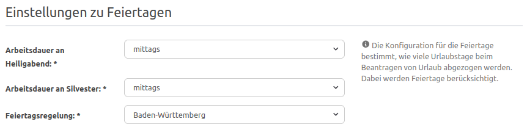
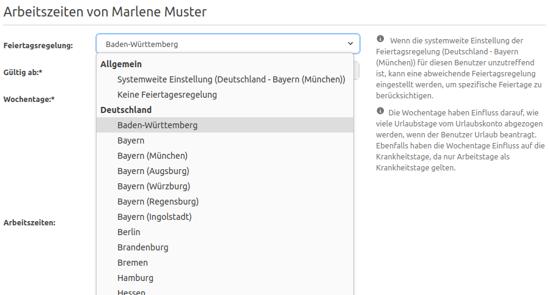

# Feiertage in focus:shift

## Wie kann ich die Feiertage für die Urlaubsverwaltung konfigurieren?

Personen mit der Berechtigung _Office_ finden in der Navigation unter "Einstellungen" den Punkt "Feiertagsregelung".
Unter "Globale Feiertagsregelung" wird das Land und die Region (z. B. das Bundesland in Deutschland) ausgewählt,
dessen Feiertage nicht als Arbeitstage beim Beantragen von Urlaub gezählt werden sollen. Mit "Keine Feiertagesregelung"
werden keine Feiertage berücksichtigt.

Außerdem kann über "Arbeitsdauer an Heiligabend" und "Arbeitsdauer an Silvester" festgelegt werden, wie diese Tage
behandelt werden sollen: ganztägig, vormittags, nachmittags oder gar nicht.

    

## Kann ich für einen bestimmten Mitarbeitenden die geltenden Feiertage konfigurieren?

Ja, die globale Feiertagsregelung kann für eine Person durch eine persönliche Feiertagsregelung überschrieben werden.
Die Feiertagsregelung gehört zu den Arbeitszeiten der Person: Im Konto der Person kann eine Person mit der Berechtigung
_Office_ im Bereich "Arbeitszeiten" über "Bearbeiten" unter "Feiertagsregelung" ein abweichendes Land bzw. eine
abweichende Region auswählen. Die Feiertage für die Person werden dann anhand des persönlichen Landes bzw. der Region
berechnet.

Über "Gültig ab" wird festgelegt, ab wann die Arbeitszeiten und damit auch die Feiertagsregelung gelten. So kann z. B.
bei einem Umzug in ein anderes Bundesland die neue Feiertagsregelung ab einem bestimmten Datum hinterlegt werden.

    

## Welche Feiertage sind vorhanden?

Die Urlaubsverwaltung bietet alle geltenden Feiertage der folgenden Länder an:

- 🇩🇪 Deutschland – alle Bundesländer, in Bayern zusätzlich München, Augsburg, Würzburg, Regensburg und Ingolstadt
- 🇧🇪 Belgien
- 🇧🇬 Bulgarien
- 🇫🇮 Finnland – auch Åland
- 🇬🇷 Griechenland
- 🇮🇹 Italien
- 🇭🇷 Kroatien
- 🇱🇹 Litauen
- 🇲🇹 Malta
- 🇳🇱 Niederlande
- 🇦🇹 Österreich – alle Bundesländer
- 🇵🇱 Polen
- 🇵🇹 Portugal – auch Azoren und Madeira
- 🇷🇴 Rumänien
- 🇨🇭 Schweiz – alle Kantone
- 🇪🇸 Spanien – alle autonomen Gemeinschaften, Ceuta und Melilla sowie Barcelona
- 🇬🇧 Vereinigtes Königreich – England, Schottland, Wales, Nordirland, Isle of Man, Jersey, Guernsey und Alderney
- 🇺🇸 USA – Washington, D.C., Virginia und Maryland

Auch Besonderheiten wie z. B. das Augsburger Friedensfest sind mit dabei.

Sollte uns ein Feiertag fehlen, dann schreibe uns gerne eine [E-Mail](mailto:support@focus-shift.de?subject=Feiertage)!
