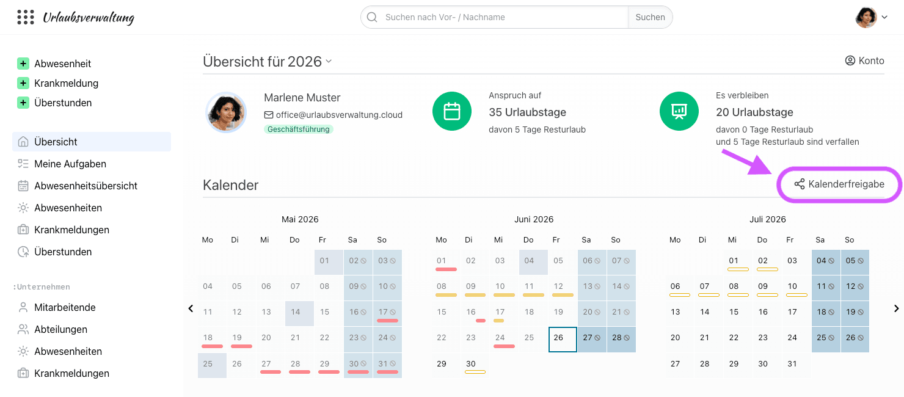
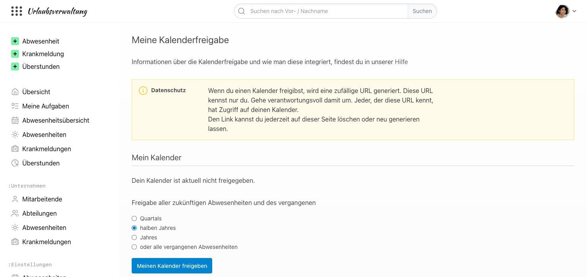
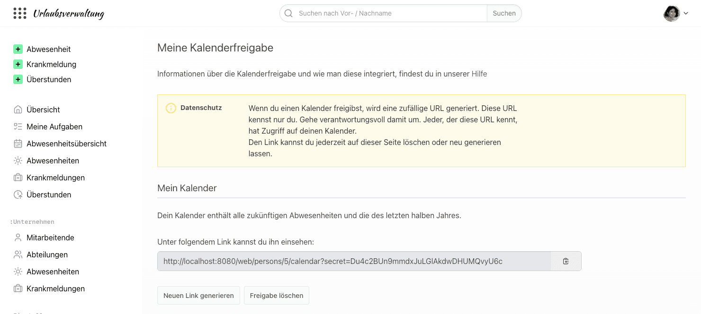
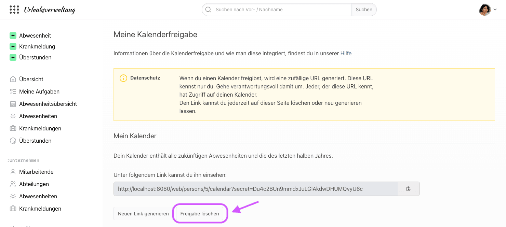
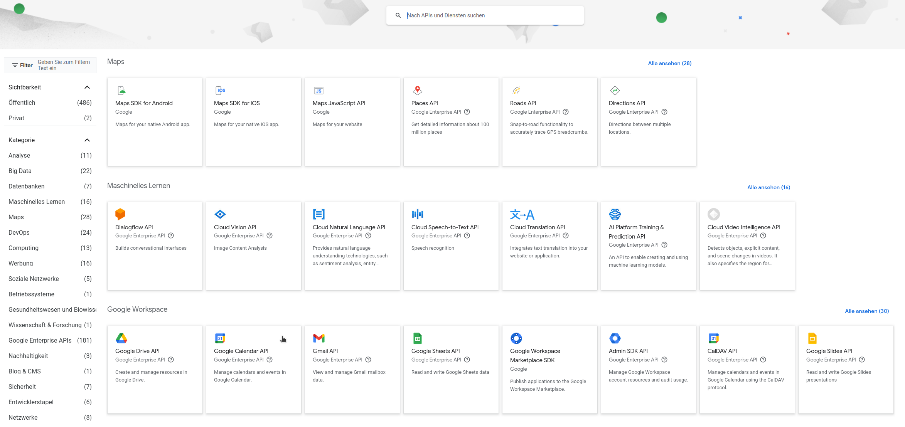
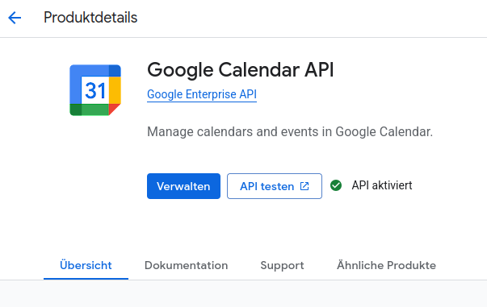
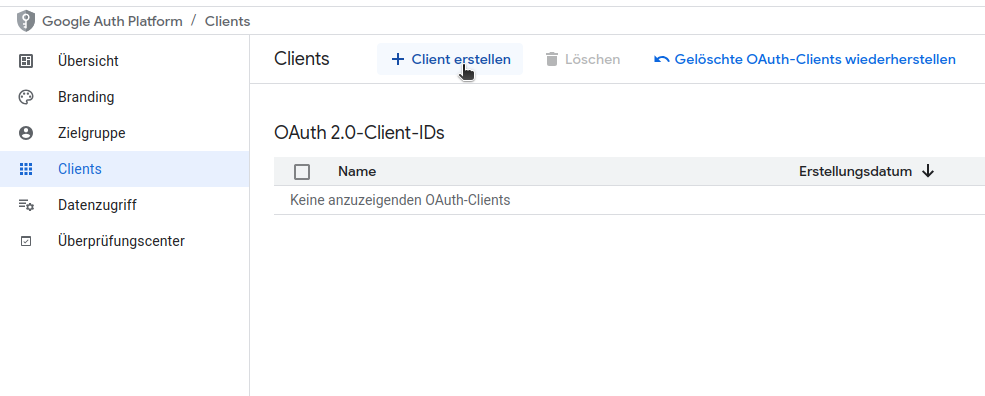
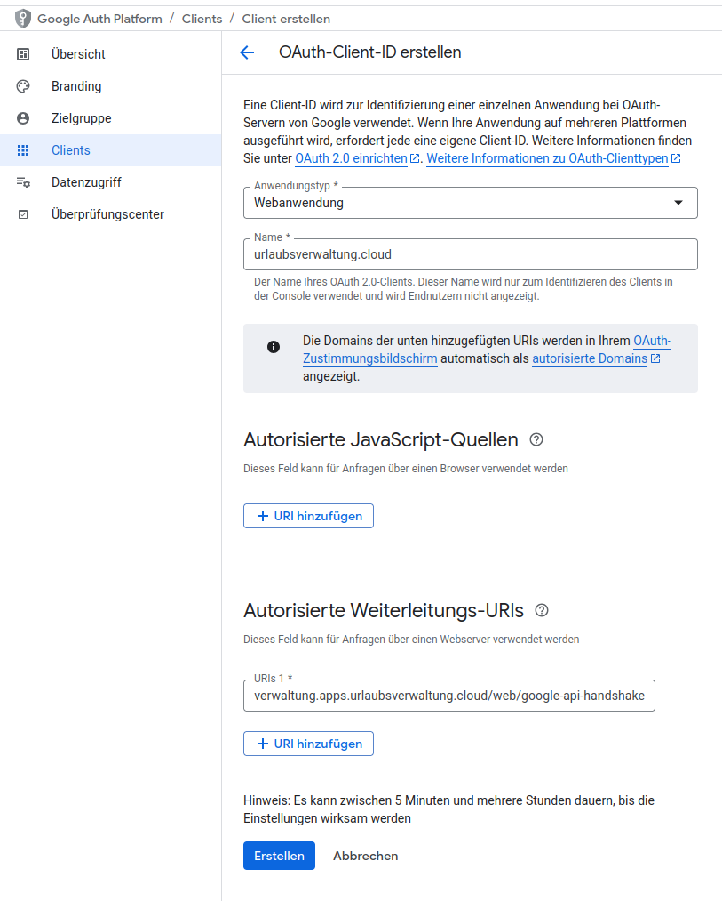
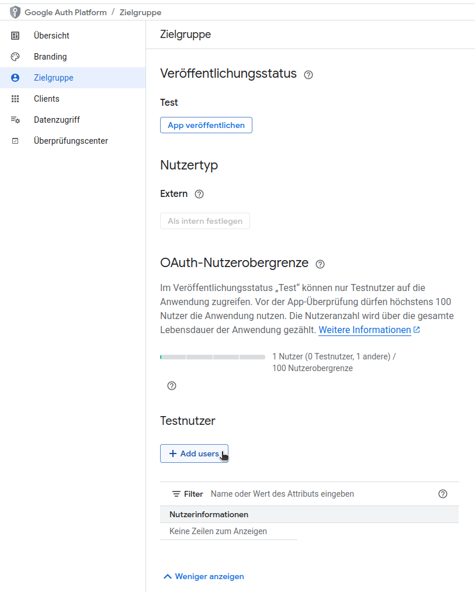

# Kalenderintegration in focus:shift

## Kalenderfreigabe

### In welchem Format werden die Kalender der Urlaubsverwaltung freigegeben?

Die Urlaubsverwaltung ermöglicht die Freigabe von Abwesenheiten im iCal-Format.

### Was ist das iCal-Format?

iCal oder auch iCalendar ist ein standardisiertes Datenformat zum Austausch von Kalenderinhalten. Das iCalendar-Format wird von der Mehrzahl von Kalender-Programmen akzeptiert und bietet die Möglichkeit Kalenderdaten einzubinden (abonnieren).

### Welche Formen der Kalenderfreigabe gibt es?

Die Urlaubsverwaltung bietet die folgenden Möglichkeiten für eine Kalenderfreigabe:

- **Mein Kalender**: Der Freigabe-Link enthält nur deine Abwesenheiten
- **Abteilung**: Der Freigabe-Link enthält die Abwesenheiten deiner Abteilung. Bist du Mitglied in mehreren Abteilungen, gibt es pro Abteilung einen eigenen Freigabe-Link.
- **Firma**: Der Freigabe-Link enthält die Abwesenheiten deiner Firma. Diese Freigabe ist nur möglich, wenn eine Person mit der Berechtigung _Office_ oder _Chef_ den Firmenkalender auf der Seite "Kalenderfreigabe" aktiviert hat. Wird der Firmenkalender wieder deaktiviert, werden alle Freigaben des Firmenkalenders gelöscht.

<aside class="wissensbasis-info">
  

    Diesen Freigabe-Link kennst nur du. Gehe verantwortungsvoll damit um. Jeder, der diese URL kennt, hat Zugriff auf deinen Kalender.
  

</aside>

### Wie kann ich einen Kalender freigeben?

Die Kalenderfreigabe kann pro Benutzer konfiguriert werden. Um die Konfiguration in der Urlaubsverwaltung durchzuführen sind folgende Schritte zu tun:

1. Klicke auf "Kalenderfreigabe" in der Übersichtsseite oberhalb des Kalenders

2. Wähle aus, welche vergangenen Abwesenheiten der Kalender enthalten soll (die des letzten Quartals, halben Jahres, Jahres oder alle), und klicke z. B. auf "Meinen Kalender freigeben". Zukünftige Abwesenheiten sind immer enthalten.

3. Es wird ein geheimer Link generiert, welchen du jetzt zum Abonnieren verwenden kannst. Weitere Informationen über das Abonnieren findest du [hier](#welche-moeglichkeiten-habe-ich-eine-ical-kalenderfreigabe-in-meinem-client-zu-verwenden).
   Über "Neuen Link generieren" erhältst du einen neuen geheimen Link, der bisherige Link funktioniert dann nicht mehr.

### Wie kann ich eine Freigabe löschen?

Eine Freigabe kann über folgende Schritte gelöscht werden:

1. Klicke auf "Kalenderfreigabe" in der Übersichtsseite oberhalb des Kalenders

   

2. Wähle beim betreffenden Kalender "Freigabe löschen". Durch das Löschen ist der Zugriff über den geheimen Link nicht mehr möglich.

   

### Welche Möglichkeiten habe ich eine iCal Kalenderfreigabe in meinem Client zu verwenden?

Hier eine Liste von Anleitungen beliebter Kalenderlösungen, welche die iCal Kalenderfreigabe unterstützen:

<ul>
<li><a href="https://support.apple.com/de-de/guide/calendar/icl1022/mac" target="_blank" rel="noopener">Apple Calendar</a></li>
<li><a href="https://support.google.com/calendar/answer/37100" target="_blank" rel="noopener">Google Calendar</a></li>
<li><a href="https://support.microsoft.com/de-de/outlook/import-or-subscribe-to-a-calendar-in-outlook-com-or-outlook-on-the-web" target="_blank" rel="noopener">Microsoft Calendar</a></li>
<li><a href="https://support.mozilla.org/de/kb/neue-kalender-erstellen#w_icalendar-ics" target="_blank" rel="noopener">Mozilla Thunderbird</a></li>
<li><a href="https://docs.nextcloud.com/server/latest/user_manual/de/groupware/calendar.html#subscribe-to-a-calendar" target="_blank" rel="noopener">Nextcloud Kalender-App</a></li>
</ul>

### Gibt es neben der iCal Kalenderfreigabe noch weitere Kalenderintegrationen?

Ja, die Urlaubsverwaltung kann Abwesenheiten und Krankmeldungen in einen [Google Calendar](#google-calendar) synchronisieren.
Die Synchronisation wird von einer Person mit der Berechtigung _Office_ unter "Einstellungen > Kalender Synchronisation" für die ganze Urlaubsverwaltung eingerichtet.
Die frühere Anbindung an Microsoft Exchange gibt es seit Version 5 der Urlaubsverwaltung nicht mehr, hier kann die iCal Kalenderfreigabe verwendet werden.

#### Welche Vorteile bietet die iCal Kalenderfreigabe?

Durch die iCal Kalenderfreigabe können die Berechtigungen und Sichtbarkeiten feingranular konfiguriert werden, wodurch ein Datenschutz-konformer Einsatz möglich wird.

## Google Calendar

Die Urlaubsverwaltung bietet die Möglichkeit, Abwesenheiten und Krankmeldungen als Termine in einen Google Calendar zu synchronisieren. Um die Synchronisation zu konfigurieren, müssen folgende Voraussetzungen erfüllt sein:

1. **Google Calendar API** ist aktiviert unter [API-Bibliothek](https://console.cloud.google.com/apis/library) ([Dokumentation](https://docs.cloud.google.com/apis/docs/getting-started))

   <figure>
       
     <figcaption class="text-sm text-center">Google Calendar API auswählen</figcaption>
   </figure>

   <figure class="mb-4">
       
     <figcaption class="text-sm text-center">Google Calendar API aktivieren</figcaption>
   </figure>

2. Ein **OAuth2 Client** als Webanwendung ist erstellt

   Gehe dazu auf https://console.cloud.google.com/apis/dashboard und führe folgende Schritte aus:

   - OAuth2-Client-ID erstellen

    <figure class="mb-4">
       
     <figcaption class="text-sm text-center">Google OAuth2 Client erstellen</figcaption>
   </figure>
   - OAuth2-Client-ID als Webanwendung (Anwendungstyp) konfigurieren

    <figure class="mb-4">
       
     <figcaption class="text-sm text-center">Google OAuth2 Client erstellen</figcaption>
   </figure>
   - Autorisierte Weiterleitungs-URIs angeben (siehe dazu die Information in den Einstellungen der Urlaubsverwaltung)
   - Client-ID und Clientschlüssel sind für Punkt 5 notwendig

3. Unter "Zielgruppe" ist ein Testnutzer angelegt

   Der **Testnutzer** entspricht dem Benutzerkonto der Person, die den Google-Kalender zur Synchronisation verwendet.

   Solange sich eine App mit der Zielgruppe „Extern“ im Status „Testen“ befindet, laufen die Zugriffe nach Googles Richtlinien nach 7 Tagen ab und die Synchronisation stoppt.
   Veröffentliche die App deshalb unter „Zielgruppe“ als „In Produktion“ oder verwende die Zielgruppe „Intern“, wenn dein Google-Kalender zu einer Google-Workspace-Organisation gehört.

   <figure class="mb-4">
        
      <figcaption class="text-sm text-center">Google OAuth2 Client Testnutzer</figcaption>
    </figure>

4. Die **Kalender ID** ist notiert

   Die **Kalender-ID** entspricht der **E-Mail-Adresse deines Google-Kontos** (bei Verwendung des primären Kalenders), das für die Synchronisation genutzt wird. Diese ID ist erforderlich, um den Kalender in der Urlaubsverwaltung einzubinden. Du findest sie in den **Einstellungen deines [Google Kalenders](https://calendar.google.com/)**.

5. Handshake ist in der Urlaubsverwaltung durchgeführt

   Wähle in deiner Urlaubsverwaltung unter **„Einstellungen > Kalender Synchronisation“** bei **„Kalenderanbindung“** den Eintrag **„Google Kalender“** aus und trage alle Informationen aus den vorherigen Punkten ein. Anschließend klickst du auf **„Zugriff erlauben“**. Es öffnet sich eine Seite, auf der du dich mit deinem Google-Konto anmelden kannst. Nach erfolgreicher Anmeldung erscheint die Bestätigung: **„Verbindung zum Google-Kalender ist hergestellt.“**

   Ab jetzt werden neue und geänderte Abwesenheiten und Krankmeldungen in den Google-Kalender übertragen. Bereits bestehende Einträge werden nicht nachträglich synchronisiert.
   Änderst du später die Client-ID, den Clientschlüssel oder die Kalender-ID, musst du erneut auf **„Zugriff erlauben“** klicken.
