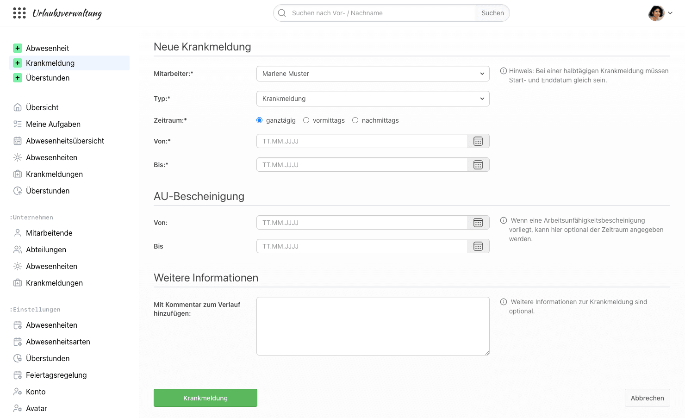
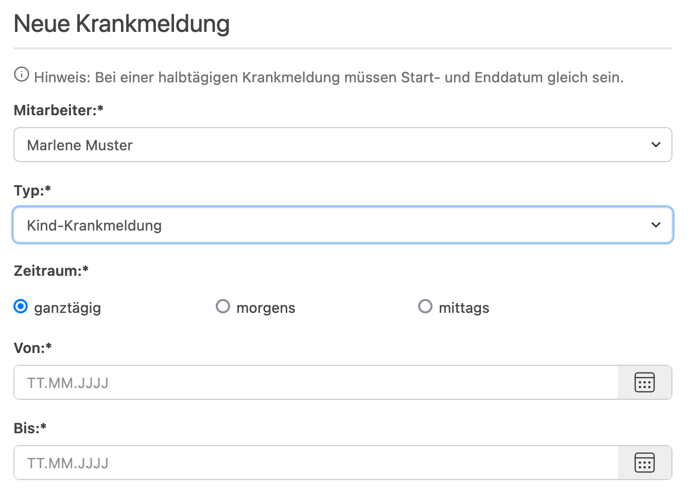
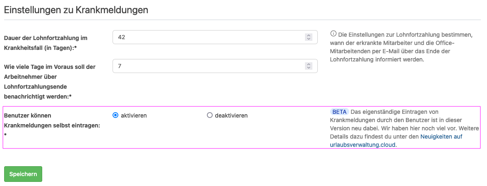
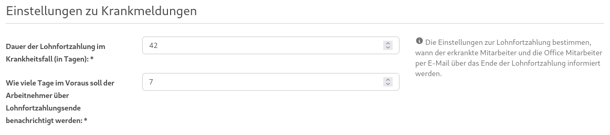
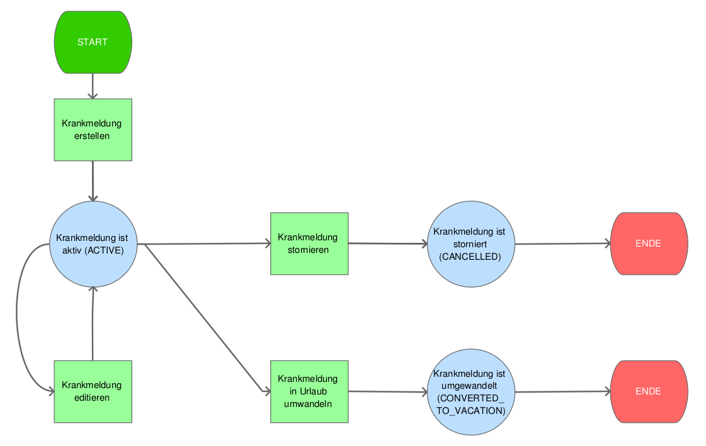

# Krankmeldungen in focus:shift

## Kann eine Krankmeldung eingetragen werden?

Ja, eine Krankmeldung kann über "Einreichen > Krankmeldung" in der Navigation eingetragen werden.

Für andere Mitarbeitende dürfen Benutzende mit der Berechtigung _Office_ Krankmeldungen eintragen.
Chefs, Abteilungsleiter und Freigabe-Verantwortliche benötigen dafür zusätzlich die Berechtigung _Pflege von Krankmeldungen_.
Abteilungsleiter und Freigabe-Verantwortliche können damit die Krankmeldungen der Mitarbeitenden pflegen, für die sie zuständig sind.

Für eine Krankmeldung können alle relevanten Informationen, wie z. B. den Zeitraum der AU-Bescheinigung, erfasst werden.

## Ist es möglich eine Kind-Krankmeldung zu erfassen?

Ja, eine Kind-Krankmeldung kann erfasst werden, indem der Typ von _Krankmeldung_ auf _Kind-Krankmeldung_ umgestellt wird.

    

## Kann eine Mitarbeitende die Krankmeldung selbst einreichen?

Ja, Mitarbeitende können ihre Krankmeldung selbst über "Einreichen > Krankmeldung" einreichen.
Gesteuert wird das unter "Einstellungen > Abwesenheiten" im Abschnitt "Einstellungen zu Krankmeldungen" mit der Einstellung
"Benutzer können Krankmeldungen selbst eintragen". Für neue Urlaubsverwaltungen ist diese Einstellung standardmäßig aktiviert.

Weitere Informationen zur Verwendung finden sich in [diesem Blog-Beitrag](/neuigkeiten/2024-06-21-selbsteintragen-von-krankmeldungen/)

    

## Wer nimmt eine eingereichte Krankmeldung an?

Eine selbst eingereichte Krankmeldung hat zunächst den Status "eingereicht". Sie wird von einer berechtigten Person
angenommen: Personen mit der Berechtigung _Office_ oder Chefs, Abteilungsleiter und Freigabe-Verantwortliche mit der
zusätzlichen Berechtigung _Pflege von Krankmeldungen_. Die eingereichten Krankmeldungen findest du unter "Meine Aufgaben"
im Abschnitt "Eingereichte Krankmeldungen von Kolleg:innen". Mit "Annehmen" wird die Krankmeldung aktiv.

Solange die Krankmeldung noch nicht angenommen wurde, kann die Mitarbeitende sie noch selbst bearbeiten.

## Kann eine Krankmeldung verlängert werden?

Ja. Ist die Mitarbeitende länger krank als gedacht, kann sie ihre laufende oder gerade beendete Krankmeldung selbst
verlängern. Dazu wählt sie wie gewohnt "Einreichen > Krankmeldung" und wird automatisch zu "Weiter Krank melden"
geleitet. Dort gibt sie an, wie lange sie voraussichtlich noch krank ist, z. B. einen weiteren Tag, bis zum Ende der Woche
oder bis zu einem anderen Tag. Alternativ kann sie auch eine neue Krankmeldung anlegen.

Die Verlängerung muss anschließend von einer berechtigten Person mit "Verlängerung akzeptieren" angenommen werden.
Das Verlängern ist nur möglich, wenn Mitarbeitende ihre Krankmeldungen selbst einreichen dürfen.

## Wird an das Ende der Lohnfortzahlung erinnert?

Ja, die Urlaubsverwaltung erinnert sowohl den Mitarbeiter als auch Personen mit der Berechtigung
_Office_ an das Ende der Lohnfortzahlung, sofern der zusammenhängende Zeitraum einer Krankmeldung
sechs Wochen übersteigt.

Hierzu können unter _Einstellungen_ > _Abwesenheiten_ die entsprechenden Zeiten gepflegt werden:

    

## Ablauf bei Krankmeldungen

    

Ergänzend zum Diagramm:

- Eine von der Mitarbeitenden selbst eingereichte Krankmeldung ist zunächst "eingereicht" und wird erst nach der Annahme aktiv.
- Eine aktive Krankmeldung kann von Personen mit der Berechtigung _Office_ in eine Abwesenheit einer beliebigen Abwesenheitsart umgewandelt werden, nicht nur in Urlaub.

## Was passiert, wenn eine Krankmeldung in einem Urlaubszeitraum angelegt wird?

Wenn eine Krankmeldung innerhalb eines gebuchten Urlaubs angelegt wird, wird
momentan der Urlaub für die Krankheitstage nicht automatisch storniert. Man muss
den Urlaub händisch stornieren und anschließend die Krankmeldung anlegen.

Beispiel: Max Mustermann hat Urlaub vom 23.11. bis 27.11. und war nun am 25.11.
krank

Vorgehen:

- Man storniert den kompletten Urlaubsantrag (vom 23.11. bis 27.11.)
- Man legt eine Krankmeldung für den 25.11. an
- Man legt Urlaub vom 23.11. bis 24.11. sowie vom 26.11. bis 27.11. an
