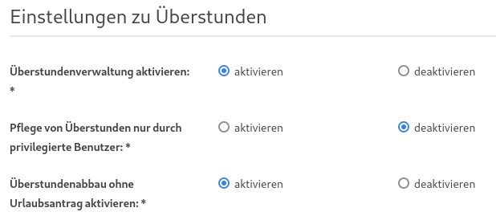
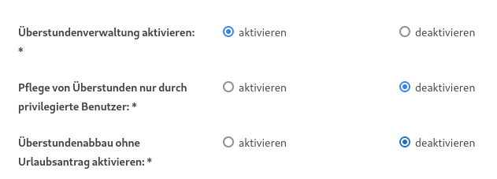
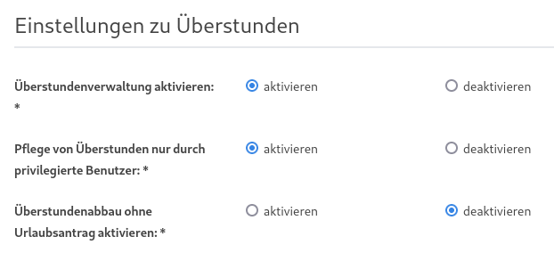
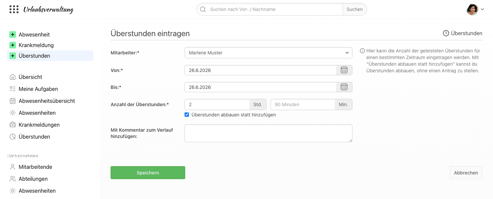

# Überstundenverwaltung in focus:shift

## Gibt es die Möglichkeit Überstunden zu erfassen?

Ja, die Urlaubsverwaltung bietet die Möglichkeit schnell und einfach Überstunden zu erfassen. Diese können ebenfalls abgebaut werden oder auch über einen Antrag auf Überstundenabbau durch eine privilegierte Person freigegeben werden. Es sind verschiedene Arbeitsweisen der Überstundenverwaltung möglich. Diese sind [hier](#welche-arbeitsweisen-sind-moeglich-ueberstunden-im-unternehmen-abzubilden) zusammengefasst.

Um die Überstundenverwaltung nutzen zu können, muss sie unter "Einstellungen > Überstunden" mit "Überstundenverwaltung aktivieren" eingeschaltet werden.

Nutzt ihr zusätzlich die Zeiterfassung, können die Überstunden auch automatisch aus der Zeiterfassung übernommen werden, siehe [Überstundenübernahme aus der Zeiterfassung](#werden-ueberstunden-aus-der-zeiterfassung-uebernommen).

## Wer wird informiert, wenn ein Überstundeneintrag angelegt wurde?

Wenn ein Überstundeneintrag erstellt oder ein bereits bestehender bearbeitet wurde, erhalten eine E-Mail:

- die Person selbst, insbesondere wenn jemand anderes den Eintrag für sie angelegt hat
- Personen mit der Berechtigung Office, Chef, Abteilungsleiter oder Freigabe-Verantwortlicher, die für die Person zuständig sind

Vorausgesetzt ist jeweils, dass die entsprechende E-Mail-Benachrichtigung aktiviert ist.
Für Überstunden, die aus der Zeiterfassung übernommen werden, werden keine E-Mails verschickt.

## Welche Arbeitsweisen sind möglich Überstunden im Unternehmen abzubilden?

Die folgenden Arbeitsweisen werden über die Einstellungen unter "Einstellungen > Überstunden" konfiguriert.
Ist die [Überstundenübernahme aus der Zeiterfassung](#werden-ueberstunden-aus-der-zeiterfassung-uebernommen) aktiv, stehen diese Einstellungen nicht zur Verfügung.

### Eigenverantwortliche Erfassung

Die Überstunden als auch der Abbau von Überstunden kann durch den Mitarbeiter eigenverantwortlich in der Urlaubsverwaltung dokumentiert werden.

Um diesen Workflow verwenden zu können, müssen folgende Einstellungen konfiguriert sein:

- "Überstundenverwaltung aktivieren": aktivieren
- "Pflege von Überstunden nur durch privilegierte Benutzer": deaktivieren
- "Überstundenabbau ohne Antrag aktivieren": aktivieren

### Eigenverantwortliche Erfassung und Antrag auf Abbau

Diese Form der Überstundenverwaltung ermöglicht die Erfassung der Überstunden durch den Mitarbeiter. Zum Abbau von Überstunden muss ein Antrag auf Überstundenabbau gestellt werden.

Um diesen Workflow verwenden zu können, müssen folgende Einstellungen konfiguriert sein:

- "Überstundenverwaltung aktivieren": aktivieren
- "Pflege von Überstunden nur durch privilegierte Benutzer": deaktivieren
- "Überstundenabbau ohne Antrag aktivieren": deaktivieren

### Erfassung durch privilegierte Person und Antrag Überstundenabbau

Diese Form der Überstundenverwaltung ermöglicht die Erfassung der Überstunden durch eine privilegierte Person (Person mit der Berechtigung Office, Chef, Abteilungsleiter oder Freigabe-Verantwortlicher).

Um diesen Workflow verwenden zu können, müssen folgende Einstellungen konfiguriert sein:

- "Überstundenverwaltung aktivieren": aktivieren
- "Pflege von Überstunden nur durch privilegierte Benutzer": aktivieren
- "Überstundenabbau ohne Antrag aktivieren": deaktivieren

## Werden Überstunden aus der Zeiterfassung übernommen?

Ja, auf focus-shift.de werden die Überstunden aus der Zeiterfassung automatisch in die Urlaubsverwaltung übernommen,
solange unter "Einstellungen > Überstunden" die Einstellung "Überstundenübernahme aktivieren" eingeschaltet ist.
Übernommen werden nur festgeschriebene Überstunden. Wie Zeiteinträge festgeschrieben werden, kannst du in der
[Hilfe zu Zeiteinträgen](/hilfe/zeiterfassung/zeiteintraege/) nachlesen.

Solange die Überstundenübernahme aktiv ist:

- kommen die Überstunden aus der Zeiterfassung, die übernommenen Einträge können in der Urlaubsverwaltung nicht bearbeitet werden
- können nur Personen mit der Berechtigung Office zusätzlich Überstunden von Hand eintragen und bearbeiten, z. B. für einen Startsaldo oder die Auszahlung von Überstunden
- werden die Einstellungen "Pflege von Überstunden nur durch privilegierte Benutzer", "Überstundenabbau ohne Antrag aktivieren" sowie die maximale Anzahl der Über- und Minusstunden ausgeblendet

Die Überstundenübernahme kann nur für alle Benutzenden gemeinsam deaktiviert werden.
Danach werden die Überstunden manuell in der Urlaubsverwaltung gepflegt.

## Kann ich die Überstundenfunktion deaktivieren?

Ja. Unter "Einstellungen > Überstunden" kann die Überstundenverwaltung
deaktiviert werden. Dies hat zur Folge, dass keine
Überstundeneinträge angelegt werden können. Außerdem wird die
Überstundenübersicht auf der persönlichen Übersichtsseite ausgeblendet.

Sollte die Überstundenfunktion in der Vergangenheit genutzt worden sein und wird
nachträglich deaktiviert, so hat dies keine Auswirkung auf die bestehenden
Überstundeneinträge; diese bleiben erhalten. Es können allerdings keine neuen
Überstundeneinträge angelegt werden.

## Kann ich die Überstundenpflege nur für privilegierte Benutzer erlauben?

Ja, durch die Einstellung "Pflege von Überstunden nur durch privilegierte Benutzer" unter "Einstellungen > Überstunden" ist das Eintragen und Bearbeiten von Überstunden auf privilegierte Benutzer eingeschränkt:

- Office und Chef dürfen die Überstunden aller Personen pflegen.
- Abteilungsleiter und Freigabe-Verantwortliche dürfen ihre eigenen Überstunden und die der Personen pflegen, für die sie zuständig sind.

Anwender in der normalen Benutzer-Rolle dürfen ihre Überstunden dann lediglich einsehen.

Ist die Einstellung deaktiviert, pflegt jede Person ihre eigenen Überstunden. Office darf die Überstunden aller Personen pflegen.

## Können Überstundeneinträge gelöscht werden?

Nein, Überstundeneinträge können nicht gelöscht werden. Ein fehlerhafter Eintrag kann aber bearbeitet oder durch
einen weiteren Eintrag ausgeglichen werden. Zu jedem Eintrag können außerdem Kommentare hinterlegt werden.

## Ist es möglich für einen Urlaubsantrag auf Überstundenabbau eine minimale Stundenanzahl zu konfigurieren?

Ja, ein Urlaubsantrag auf Überstundenabbau ist mit einer Minimalstundenanzahl konfigurierbar. Damit müssen pro Antrag mindestens die konfigurierten Minimalstunden abgebaut werden. Diese Minimalstundenanzahl kann unter "Einstellungen > Überstunden" im Feld "Minimale Anzahl an abgebauten Stunden pro Antrag" eingetragen werden. Der Standardwert ist 0, also keine Mindestanzahl.

## Können Überstunden abgebaut werden?

Ja, dabei einfach Überstunden eintragen und dabei den Haken mit "Überstunden abbauen statt hinzufügen" setzen. Damit wird die eingetragene Zeit vom Überstundenkonto abgezogen. Dafür muss die Überstundenerfassung aktiv sein, siehe dazu auch ["Eigenverantwortliche Erfassung"](#eigenverantwortliche-erfassung).

    

## Ist der Überstundenabbau deaktivierbar?

Ja, die Funktionalität den Abbau von Überstunden direkt eintragen zu können, ist über eine globale Konfiguration in den Einstellungen deaktivierbar. Die Konfiguration kann unter "Einstellungen > Überstunden" mit der Einstellung "Überstundenabbau ohne Antrag aktivieren" aktiviert bzw. deaktiviert werden.

## Gibt es eine Übersicht über die Überstunden aller Mitarbeitenden?

Ja, unter "Unternehmen > Überstunden" findest du eine Statistik über die Überstunden der Mitarbeitenden.
Personen mit der Berechtigung Office oder Chef sehen dort alle Mitarbeitenden, Abteilungsleiter und Freigabe-Verantwortliche
die Mitarbeitenden, für die sie zuständig sind.
