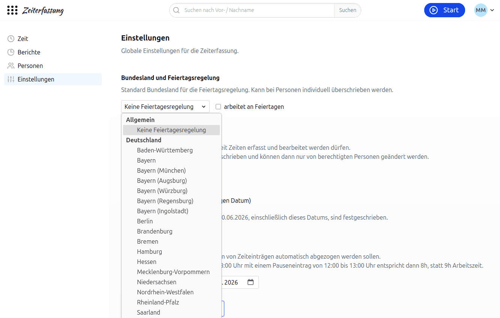
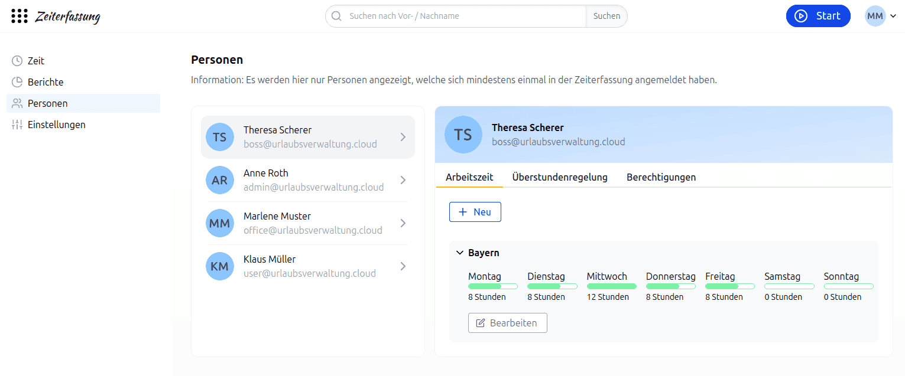

# Feiertage in der Zeiterfassung

## Wie kann ich die globale Feiertagsregelung für die Zeiterfassung konfigurieren?

In den Einstellungen der Zeiterfassung kann unter "Bundesland und Feiertagsregelung" eine globale Feiertagsregelung konfiguriert werden.
Diese Regelung gilt für alle Mitarbeitenden, die in der Zeiterfassung erfasst sind.
Die Einstellung können Personen mit der Berechtigung "darf die globalen Einstellungen bearbeiten" vornehmen.
Standardmäßig ist "Keine Feiertagesregelung" ausgewählt. Zusätzlich lässt sich global festlegen, ob an Feiertagen gearbeitet wird ("arbeitet an Feiertagen").

    

Falls du für einen bestimmten Mitarbeitenden eine individuelle Feiertagsregelung benötigst,
kannst du diese in der Arbeitszeit des Mitarbeitenden konfigurieren.
Das überschreibt die globale Einstellung.

## Kann ich für einen bestimmten Mitarbeitenden eine individuelle Feiertagsregelung konfigurieren?

Ja, bei verteilten Teams ist es nicht selten, dass unterschiedliche Anforderungen an Feiertagsregelungen existieren.
Für Mitarbeitende, die in Baden-Württemberg angestellt sind, gelten andere Feiertagsregelungen als z. B. in Hessen.
Daher kannst du die Feiertagsregelung für jeden Mitarbeitenden individuell anpassen.

Die Feiertagsregelung gehört zur Arbeitszeit eines Mitarbeitenden. Du findest sie unter "Personen", Auswahl der Person,
"Arbeitszeit" und dann "Neu" bzw. "Bearbeiten" im Abschnitt "Bundesland (Feiertage)".
Dort kannst du die "Globale Feiertagsregelung" übernehmen, ein anderes Bundesland oder "Keine Feiertagesregelung" auswählen
und unter "Arbeitsregelung an Feiertagen" festlegen, ob an Feiertagen gearbeitet wird.
Da jede Arbeitszeit ab einem Datum gilt ("gültig ab"), kann sich die Feiertagsregelung eines Mitarbeitenden auch ab einem bestimmten Datum ändern, z. B. bei einem Umzug.
Dafür ist die Berechtigung "darf die Arbeitszeiten aller Personen bearbeiten" notwendig.

    

## Welche Feiertagsregelungen sind vorhanden?

Die Zeiterfassung bietet alle geltenden Feiertagsregelungen der Länder

- 🇩🇪 Deutschland
- 🇧🇪 Belgien
- 🇧🇬 Bulgarien
- 🇨🇭 Schweiz
- 🇪🇸 Spanien
- 🇫🇮 Finnland
- 🇬🇧 Vereinigtes Königreich
- 🇬🇷 Griechenland
- 🇭🇷 Kroatien
- 🇮🇹 Italien
- 🇱🇹 Litauen
- 🇲🇹 Malta
- 🇳🇱 Niederlande
- 🇦🇹 Österreich
- 🇵🇱 Polen
- 🇵🇹 Portugal – auch Azoren und Madeira
- 🇷🇴 Rumänien
- 🇺🇸 USA – Washington, D.C., Virginia und Maryland

Auch Besonderheiten wie das Augsburger Friedensfest sind dabei.

Dir fehlen Feiertage für ein bestimmtes Land? Dann kontaktiere uns am einfachsten per E-Mail, wir freuen uns über dein Feedback!
Sollte uns ein Feiertag fehlen, dann schreibe uns gerne eine [E-Mail](mailto:support@focus-shift.de?subject=Feiertage)!
