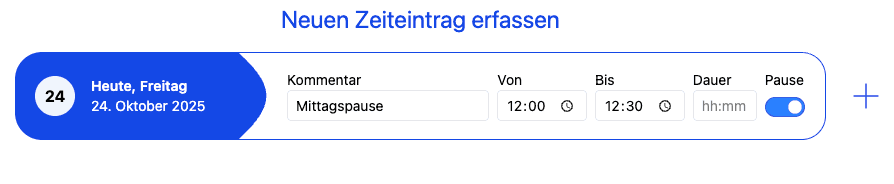
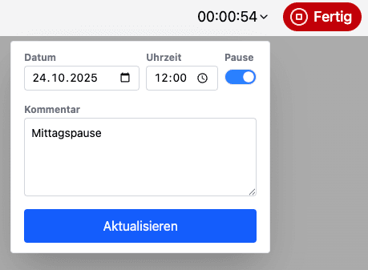
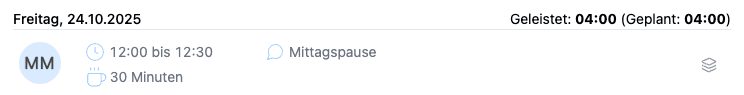
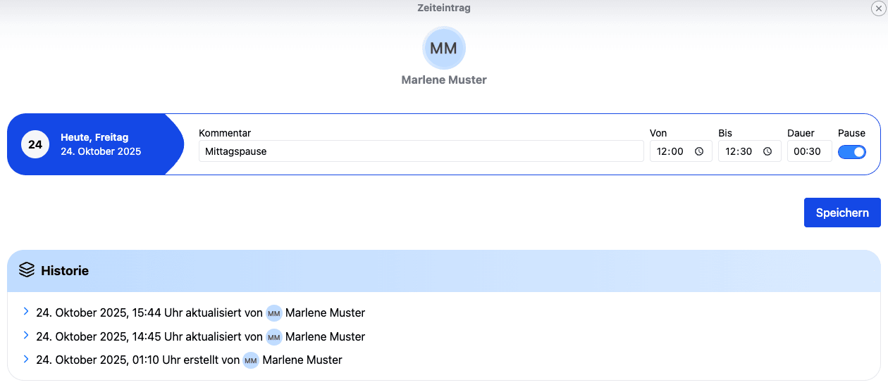

# Pausen in der Zeiterfassung

## Wie kann ich Pausen erfassen?

### Neue Pausen erfassen

Auf der Startseite unter "Zeit" kannst du für dich selbst Pausen erfassen. Wichtig ist, den Pause-Regler zu aktivieren.
Du kannst den Tag auswählen, einen Kommentar sowie eine Start- und Endzeit eingeben, die Dauer wird automatisch berechnet.

    

Wenn nur Startzeit und Dauer angegeben werden, wird die Endzeit automatisch gesetzt.

### Zeiteintrag mit der Stoppuhr erfassen

Pausen können auch mit der Stoppuhr erfasst werden.
Starte dazu die Stoppuhr, öffne die Bearbeitung der laufenden Stoppuhr und aktiviere dort den Regler "Pause".
Die Stoppuhr läuft im Hintergrund weiter, auch wenn du die Seite wechselst.
Du kannst die Stoppuhr jederzeit anhalten und so die Pause speichern.

    

In der Bearbeitung der laufenden Stoppuhr kannst du auch einen Kommentar hinzufügen oder die Startzeit nachträglich ändern.
Der Kommentar wird dann automatisch zur Pause hinzugefügt.

### Pausen im Bericht

In Berichten werden neben den Zeiteinträgen auch die Pausen angezeigt.

    

Auch im CSV-Download werden sie aufgelistet.

### Historie einer Pause

Wie jeder Zeiteintrag hat auch jeder Pauseneintrag eine Änderungshistorie.
So können alle Änderungen nachvollzogen werden.
Die Historie öffnest du in den Berichten über das Historie-Symbol des Eintrags.

    
