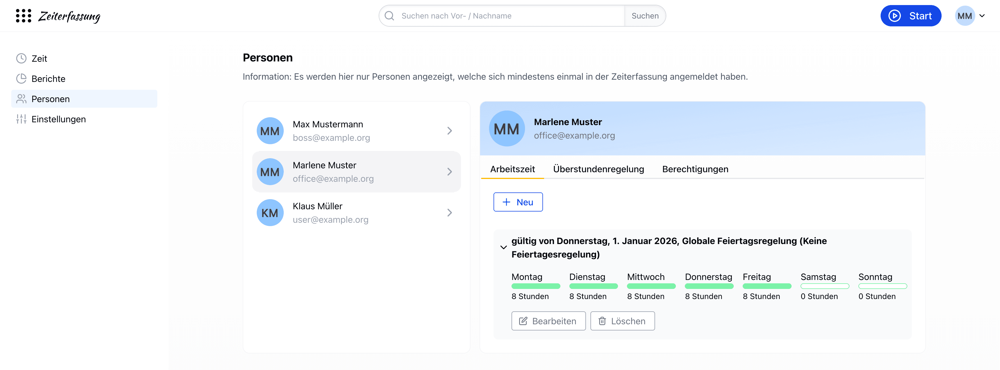
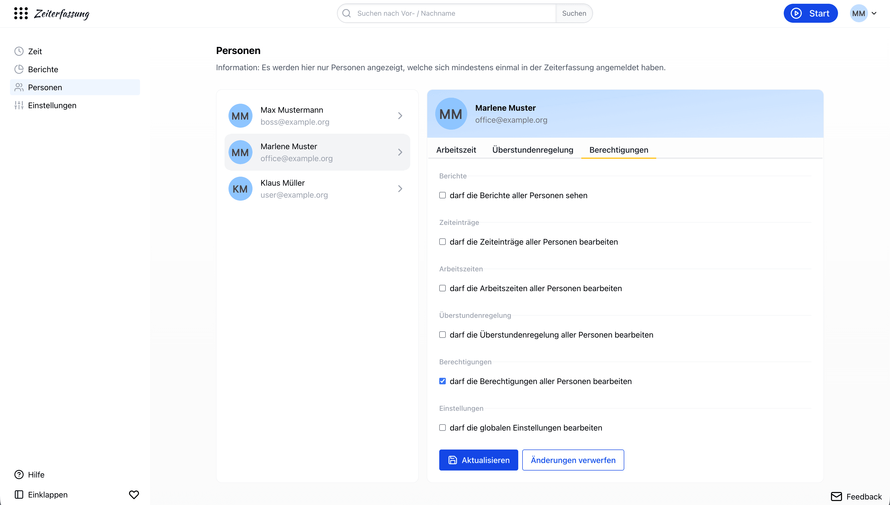

# Personen und deren Berechtigungen, Arbeitszeiten und Überstundenregelung in der Zeiterfassung

Ohne Mitarbeitende kein Unternehmen. Die Verwaltung der Mitarbeitenden und ihrer Berechtigungen ist ein zentraler Bestandteil der Zeiterfassung.

Unter "Personen" erscheinen alle Personen, die im [Kundenportal eingeladen](/hilfe/kundenportal/onboarding/) wurden – auch wenn sie sich noch nicht in der Zeiterfassung angemeldet haben.

## Arbeitszeiten pro Mitarbeitenden festlegen

Die Arbeitszeiten können pro Mitarbeitenden individuell festgelegt werden – sowohl für die ganze Woche als auch detailliert pro Wochentag. Diese Einstellungen können von Mitarbeitenden mit der Berechtigung "darf die Arbeitszeiten aller Personen bearbeiten" vorgenommen werden.

Ein Mitarbeitender kann mehrere Arbeitszeiten haben, die jeweils ab einem bestimmten Datum gelten ("gültig ab").
So lässt sich z. B. ein Wechsel von Vollzeit auf Teilzeit im Voraus hinterlegen.
Zu jeder Arbeitszeit gehört auch die [Feiertagsregelung](/hilfe/zeiterfassung/feiertage/) des Mitarbeitenden.

## Überstundenregelung

Im Bereich "Überstundenregelung" einer Person wird festgelegt, ob die Person Überstunden machen darf ("darf Überstunden machen").
Standardmäßig ist das erlaubt. Die Einstellung können Mitarbeitende mit der Berechtigung "darf die Überstundenregelung aller Personen bearbeiten" ändern.

Nur wenn eine Person Überstunden machen darf, werden ihre Überstunden aus festgeschriebenen Tagen an die Urlaubsverwaltung übertragen.

## Berechtigungen

### Wie stelle ich die Berechtigungen eines Mitarbeitenden ein?

Die Berechtigungen der Mitarbeitenden können unter "Personen" im Bereich "Berechtigungen" angepasst werden. Dafür ist die Berechtigung "darf die Berechtigungen aller Personen bearbeiten" notwendig.
Die erste Person, die sich in der Zeiterfassung anmeldet, erhält diese Berechtigung automatisch.
Berechtigungen können bequem und sicher angepasst werden, ohne die Anwendung zu verlassen.

### Wann greifen neue Berechtigungen für einen Benutzer?

Die Berechtigungen eines Mitarbeitenden werden wirksam, sobald der Mitarbeitende die nächste Seite in der Zeiterfassung aufruft.
Es muss also nicht gewartet werden, bis sich der Mitarbeitende erneut anmeldet. Eine bereits geöffnete Seite aktualisiert sich allerdings nicht von selbst.
