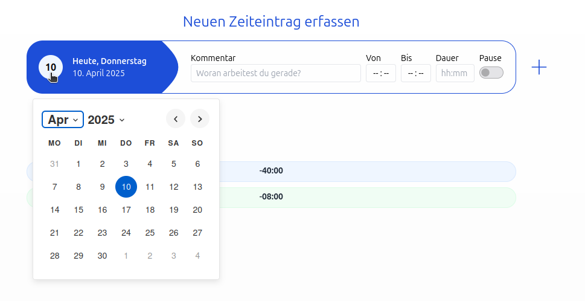
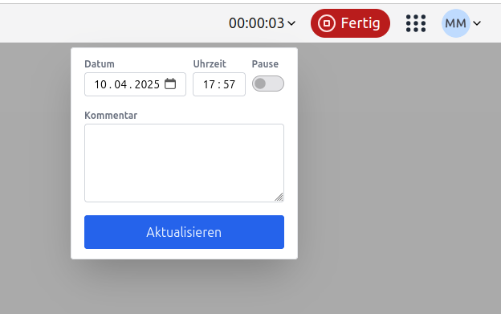
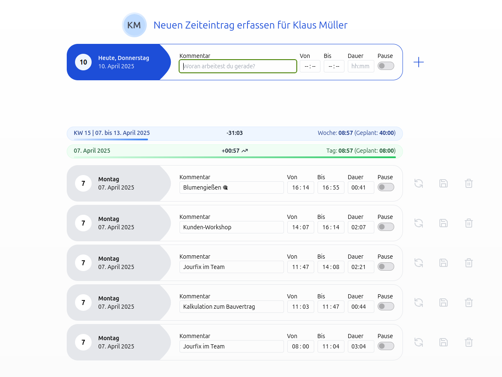
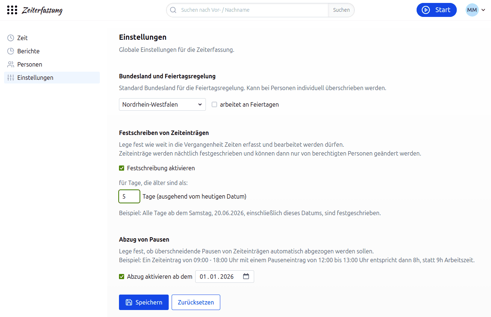
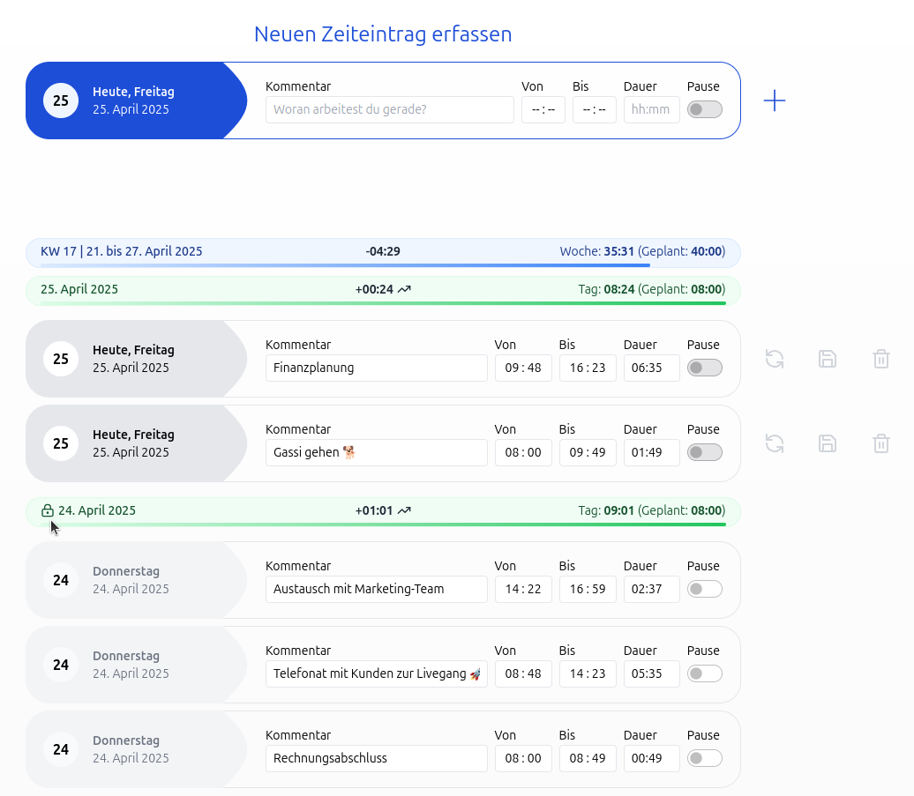

# Zeiteinträge in der Zeiterfassung

## Wie kann ich Zeiteinträge erfassen?

### Neuen Zeiteintrag erfassen

Auf der Startseite unter "Zeit" kannst du für dich selbst Zeiteinträge erfassen.
Du kannst den Tag auswählen, einen Kommentar sowie eine Start- und Endzeit eingeben, die Dauer wird automatisch berechnet.

    

Wenn nur Startzeit und Dauer angegeben werden, wird die Endzeit automatisch gesetzt.

    <video width="640" height="480" autoplay>
      <source src="neuen_zeiteintrag.mp4" type="video/mp4" />
    </video>

### Zeiteintrag mit der Stoppuhr erfassen

Zeiteinträge können auch durch Anklicken des Start-Buttons der Stoppuhr erfasst werden. Die Stoppuhr läuft im Hintergrund weiter, auch wenn du die Seite wechselst. Du kannst die Stoppuhr jederzeit anhalten und so den Zeiteintrag speichern.

Wenn du die Stoppuhr startest, kannst du auch einen Kommentar hinzufügen oder die Startzeit nachträglich ändern.
Der Kommentar wird dann automatisch zum Zeiteintrag hinzugefügt.

    

## Kann ich für einen bestimmten Mitarbeitenden Zeiteinträge erfassen?

### Zeiterfassung für andere Mitarbeitende

Mitarbeitende mit der Berechtigung "darf die Zeiteinträge aller Personen bearbeiten" haben die Möglichkeit, die Startseitenansicht eines anderen Mitarbeitenden einzusehen und für diese Person Zeiteinträge zu erfassen.

Auf der Startseite unter "Zeit" gibt es dafür das Suchfeld "Zeiten anderer Person pflegen…".
Nach Eingabe des Namens öffnet ein Klick auf "Zeit" die Startseitenansicht der gewünschten Person.
Alternativ kann die Ansicht in den Berichten mit einem Klick auf den Avatar eines Mitarbeitenden aufgerufen werden.

    

## Können Zeiteinträge festgeschrieben werden?

Ja, das Hinzufügen und Ändern von Zeiteinträgen kann für zurückliegende Tage verhindert werden, um sie vor Änderungen zu schützen.
Dies ist besonders wichtig, wenn die Zeitbuchungen für die Lohnabrechnung verwendet werden.

In der Zeiterfassung können Personen mit der Berechtigung "darf die globalen Einstellungen bearbeiten" unter
"Einstellungen > Festschreiben von Zeiteinträgen" die Festschreibung aktivieren und einstellen, nach wie vielen Tagen – ausgehend vom heutigen Datum – Zeiteinträge festgeschrieben werden.
Die Festschreibung ist standardmäßig deaktiviert. Die Tage werden jede Nacht festgeschrieben.

    

Festgeschriebene Zeiteinträge und das Hinzufügen neuer Zeiteinträgen für einen Tag, welcher festgeschrieben ist,
ist nur für Mitarbeitende mit der Berechtigung "darf die Zeiteinträge aller Personen bearbeiten" möglich.

Tage, an denen die Zeiteinträge festgeschrieben sind, sind in der Übersicht mit einem Schloss-Symbol gekennzeichnet.
Dies bedeutet, dass an diesem Tag keine weiteren Zeiteinträge hinzugefügt bzw. keine Zeiteinträge bearbeitet werden können.

    

Das Schloss-Symbol wird allen Personen angezeigt, auch Personen mit der Berechtigung "darf die Zeiteinträge aller Personen bearbeiten".
Diese können an festgeschriebenen Tagen aber weiterhin Zeiteinträge hinzufügen bzw. bearbeiten.
Die Berechtigung "darf die globalen Einstellungen bearbeiten" allein reicht dafür nicht aus.
