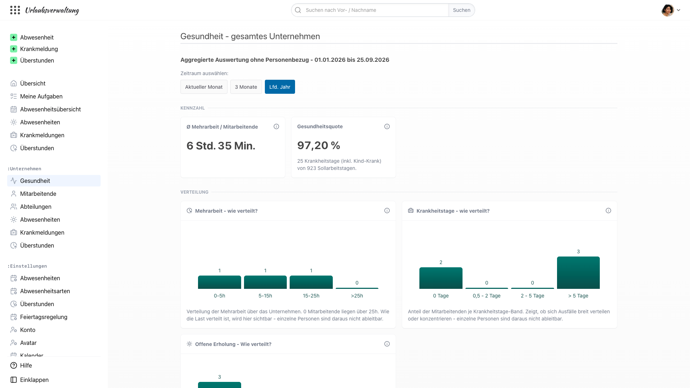

Wir haben in den vergangenen Monaten zwei Dinge getan, die zusammengehören: einen neuen Namen bekommen — focus:shift — und einen neuen Bereich in der Software eröffnet, den es vorher nicht gab. Dieser Beitrag erklärt, warum wir beides gemacht haben, und warum es dieselbe Entscheidung war.

<!-- more -->

_Klarheit statt Kontrolle — und was das mit unserem neuen Namen zu tun hat_

## Ein Freitagabend, wie du ihn vielleicht kennst

Es ist ein Freitag im Juli, kurz vor 17 Uhr. Die Wochenrunde in einem 14-köpfigen Kundenservice-Team. Am Ende sagt einer der erfahrensten Kollegen beiläufig, dass er das dritte Wochenende in Folge Tickets bearbeitet hat. Kein Vorwurf, kein Drama. Nur eine Bemerkung, die im Raum liegt.

Die Teamleitung merkt in dieser Sekunde etwas, was sie ungern denkt: _Sie hätte es wissen müssen._ Aber sie hat es nicht gewusst. Nicht weil sie schlecht führt. Sondern weil die Software, in der die Wochenenden bereits erfasst sind, es ihr nicht gezeigt hat.

Kennst du diesen Moment? Wenn eine Beobachtung dich einholt, die im System schon längst dokumentiert war, aber nirgendwo sichtbar wurde? Wenn du merkst: Nicht dein Bauchgefühl hat versagt. Zwischen den Excel-Tabellen und deinem Gedächtnis klafft eine Lücke, und nichts füllt sie.

Das ist der Moment, für den wir gebaut haben, was wir gebaut haben.

## Was HR-Software heute macht — und was sie nicht macht

Der Markt für HR-Software ist voll. Es gibt Zeiterfassung, es gibt Urlaubsverwaltung, es gibt Krankmeldungs-Systeme. Vieles davon funktioniert gut. Und trotzdem passiert der Freitagabend-Moment tausendfach, jede Woche, in Unternehmen, die alles davon einsetzen.

Der Grund ist einfach: Die meisten Systeme sind gebaut, um _einzelne Vorgänge_ zu verwalten. Ein Urlaubsantrag. Eine Krankmeldung. Ein Überstundeneintrag. Sie werden erfasst, dokumentiert, archiviert. Aber sie werden nicht zu einem Bild zusammengefügt, aus dem eine Führungskraft ablesen kann, wie es ihrem Team eigentlich geht.

Was in den letzten Jahren dazukam, sind zwei Reaktionen auf diese Lücke, die beide nicht überzeugen:

Auf der einen Seite die Dashboards mit vielen Zahlen und wenig Aussage. Sie zeigen Krankenstand, Fluktuation, Employee Net Promoter Score — Kennzahlen, die für die Geschäftsführung zusammengetragen werden, aber die Führungskraft im Alltag nicht handlungsfähig machen. Sie erklären nichts. Sie beantworten die falschen Fragen.

Auf der anderen Seite die Wellbeing-Programme und Stimmungsabfragen. Sie versuchen, aus Fragebögen zu ermitteln, was ohnehin in den Nutzungsdaten steht. Sie messen zusätzlich, statt sichtbar zu machen. Und sie erzeugen Erwartungen, die sich später nicht einlösen lassen.

Zwischen beidem gibt es einen Raum, der lange leer war. Wir haben ihn gefüllt.

## Warum aus urlaubsverwaltung.cloud focus:shift geworden ist

Vielleicht ist dir schon aufgefallen, dass neben urlaubsverwaltung.cloud jetzt auch focus:shift auftaucht. Ein neuer Name, ein neues Logo, neue Farben. Eine Zeit lang gibt es beide Auftritte noch nebeneinander. Wichtiger als das Äußere ist aber die Haltung dahinter: Sie war schon länger da und bekommt jetzt einen Namen.

**Focus Shift.** Fokus verlagern. Vom Reagieren zum Sehen. Von der einzelnen Kennzahl zum Muster. Von der Kontrolle zur Fürsorge. Vom Bauchgefühl zur Klarheit — ohne dass daraus eine Überwachungslogik wird. _Time for what matters._ Zeit für das, was zählt.

Die Software heißt immer noch, was sie schon immer war: Urlaubsverwaltung und Zeiterfassung für den Mittelstand. Open Source. In Deutschland gehostet. DSGVO-konform. Was neu ist, ist der Anspruch, dass diese Software auch etwas darüber sagen kann, wie es den Menschen geht, die sie nutzen — ohne dass jemand dabei zum gläsernen Angestellten wird.

## Was Belastungsmuster sind — und was sie nicht sind

Wir nennen den neuen Bereich in der Software „Gesundheit". Er zeigt drei Verteilungen: Mehrarbeit im Unternehmen. Offene Urlaubstage. Krankheitstage. Nicht als Rangliste einzelner Personen. Sondern als Verteilung — wie viele Menschen liegen in welchem Band, wie hat sich das gegenüber dem Vorjahr verändert, wie sieht es im Vergleich zur Restfirma aus.

    <figure>
            
        <figcaption class="text-sm text-center">Der neue Bereich „Gesundheit“: aggregierte Auswertung ohne Personenbezug</figcaption>
    </figure>

Warum Verteilungen und keine Personen? Weil ein Durchschnittswert nichts sagt. Wenn die durchschnittlichen Überstunden in einer Abteilung 7 Stunden pro Person sind, kann das bedeuten, dass alle etwa gleich viel Mehrarbeit haben — oder dass drei Personen 25 Stunden machen und der Rest nichts. Das sind zwei völlig verschiedene Führungssituationen. Der Durchschnitt versteckt das. Die Verteilung zeigt es.

Und warum ohne Personenbezug? Weil die Frage nicht ist, welche einzelne Person gerade zu viel arbeitet — das weißt du als Führungskraft besser als jede Software. Die Frage ist, ob dein Team als Ganzes ein Muster zeigt, das du sonst übersiehst. Muster, die vor dem Ausfall stehen, vor der Kündigung, vor dem Freitagabend-Moment, an dem dir jemand beiläufig erzählt, was du hättest wissen sollen.

Jede Auswertung im neuen Bereich beginnt mit einem Header, der uns wichtig ist: „Aggregierte Auswertung ohne Personenbezug." Das ist keine Marketing-Formulierung. Das ist die Grenze, die wir uns selbst gezogen haben — und die wir auch dann halten, wenn sie unbequem ist. Weil Fürsorge etwas anderes ist als Kontrolle, und wir uns entschieden haben, auf welcher Seite dieser Unterscheidung wir bauen.

## Was das für dich als Führungskraft ändert

Nicht viel — und deshalb ist es so wichtig.

Du wirst nicht plötzlich Alarme bekommen, die dir sagen, dass Marlene aus der Buchhaltung Burnout-gefährdet ist. Du wirst nicht mit Wellbeing-Scores konfrontiert, die niemand versteht. Du wirst nicht in Compliance-Trainings sitzen, in denen erklärt wird, warum das neue Dashboard eigentlich datenschutzrechtlich okay ist.

Was du bekommst, ist eine Sicht. Eine Verteilung deiner Zahlen, die dir erlaubt, das Muster zu sehen, das du sonst mühsam aus Einzeleinträgen rekonstruieren müsstest. Ein „Was du im Team prüfen kannst" unter jedem Diagramm — nicht als Handlungsanweisung, sondern als offene Frage, die dich zum eigenen Nachdenken einlädt. Und die stille Sicherheit, dass die Sicht bei dir bleibt, nicht bei einer Excel-Datei, die irgendwann in der falschen E-Mail landet.

Wenn du das nächste Mal in deiner Freitagsrunde sitzt und jemand beiläufig einen Satz sagt, der dir bekannt vorkommt, wirst du ihn vielleicht schon vorher gesehen haben. Nicht weil eine Software dir das Team abgenommen hat. Sondern weil sie sichtbar gemacht hat, was ohnehin da war.

## Ein neuer Name für eine alte Überzeugung

Gesunde Arbeit beginnt mit Überblick. Das ist der Satz, unter dem wir die Marke seit einem halben Jahr denken, und mit dem wir sie jetzt öffentlich machen. Er ist bewusst schlicht. Er verspricht keine Rettung, keine Revolution, keine bessere Zukunft. Er beschreibt eine Voraussetzung.

Und er bedeutet auch: Wir werden nie eine Software bauen, die dir sagt, was du zu tun hast. Wir werden eine Software bauen, die dir zeigt, was du wissen musst, um es selbst zu entscheiden.

Der neue Name — focus:shift — ist eine Verpflichtung, kein Marketing-Stunt. Wir werden daran gemessen werden, ob wir sie einlösen. Der neue Bereich in der Software ist der erste Schritt. Weitere folgen.

Wenn du wissen willst, wie das für dein Team konkret aussieht: [Schau dir den neuen Bereich in der Demo an](/demo/) — oder [buche ein Online-Gespräch mit jemandem aus unserem Team](/demo/#termin-vereinbaren). Beides ist unverbindlich. Beides sagt mehr als noch ein Blogpost.

Wir freuen uns, wenn du dabei bist.

_Dein focus:shift-Team_
